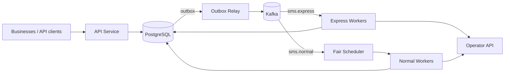

# SMS Gateway — Engineering Design Documentation

Production-oriented design for a multi-tenant SMS Gateway handling ~100M messages/day across tens of thousands of businesses with highly skewed traffic, a strict wallet-balance invariant, and a latency-guaranteed Express tier.

This is an interview deliverable written at the depth of an internal design doc: every decision states its rationale and trade-offs, not just its shape.

## Reading order

| Doc | Content |
|---|---|
| [docs/how-it-works.md](docs/how-it-works.md) | Plain-language walkthrough of one SMS request start to finish — start here if you're new |
| [docs/rfc/0001-sms-gateway-design.md](docs/rfc/0001-sms-gateway-design.md) | Formal RFC — review-ready summary of the full design, cross-referenced to every doc below |
| [docs/architecture.md](docs/architecture.md) | System topology, component responsibilities, queueing, fair scheduling, outbox, retries, DLQ |
| [docs/decisions.md](docs/decisions.md) | 12 ADRs — context, decision, consequences, alternatives considered, trade-off matrix |
| [docs/api.md](docs/api.md) | Full REST reference — purpose, request/response, validation, status codes, errors, examples per endpoint |
| [docs/database.md](docs/database.md) | Schema, ER diagram, indexing, partitioning, transactions, isolation level, concurrency |
| [docs/queue.md](docs/queue.md) | Messaging architecture — Express/Normal pipelines, fair scheduler, retries, DLQ, ordering guarantees |
| [docs/sequence-diagrams.md](docs/sequence-diagrams.md) | End-to-end flows: Single SMS, Batch SMS, Express SMS |
| [docs/scalability.md](docs/scalability.md) | Scaling path (1 → 100M/day), failure-mode analysis, capacity planning |
| [docs/deployment.md](docs/deployment.md) | Docker Compose, production topology, config, secrets, health checks, graceful shutdown |
| [docs/observability.md](docs/observability.md) | Logging, correlation IDs, tracing, metrics, dashboards, alerting |
| [docs/security.md](docs/security.md) | Rate limiting, input validation, secrets, TLS, audit logging |
| [docs/testing.md](docs/testing.md) | Test strategy — unit through load tests and failure injection |
| [docs/assumptions.md](docs/assumptions.md) | Every assumption made, with impact-if-wrong, and deferred features |

## System summary



## Non-negotiable invariants

1. **No SMS is ever accepted once balance is exhausted.** Enforced by a single atomic SQL statement, never by application-level read-then-write logic.
2. **Batch acceptance is all-or-nothing.** One atomic deduction covers the whole recipient list; there is no partial batch state at acceptance time.
3. **Express never queues behind Normal.** Physically separate topic, consumer group, and worker pool — not a priority field on a shared queue.
4. **Fairness among Normal-tier tenants is scheduling, not throttling.** A heavy tenant is never rejected for being heavy; it is deprioritized relative to other *currently active* tenants and gets full throughput when it's the only one sending.

See [docs/assumptions.md](docs/assumptions.md) for the constraints these invariants rest on, and [docs/decisions.md](docs/decisions.md) for why each one was built this way.

# Quick start

#### Install dependencies

```
uv sync --all-packages
```

#### Run unit tests
```
uv run pytest -m "not integration"
```

#### Full stack via Docker Compose
```
cp .env.example .env
docker compose up --build
```

Dev tenant (from seed migration): X-Tenant-ID: 11111111-1111-1111-1111-111111111111 with 100,000 credits.

Example:

```
curl -X POST http://localhost:8080/api/v1/sms \
  -H "X-Tenant-ID: 11111111-1111-1111-1111-111111111111" \
  -H "Idempotency-Key: $(uuidgen)" \
  -H "Content-Type: application/json" \
  -d '{"recipient":"+15551234567","message":"Hello","priority":"EXPRESS"}'
```

#### Key files
- Schema: migrations/versions/0001_init_schema.py (docs/database.md is the DDL source of truth this translates)
- API handlers: services/api/src/api_service/routers/
- DRR scheduler: services/fair_scheduler/src/fair_scheduler/drr.py
- Docker Compose: docker-compose.yml

#### Tests
- Unit: validation, cursor pagination, DRR (services/fair_scheduler/tests/unit/test_drr.py)
- Integration (`-m integration`): wallet concurrency + idempotency race via testcontainers

Run integration tests with Docker available:

```
uv run pytest -m integration services/api/tests/integration --timeout=300
```