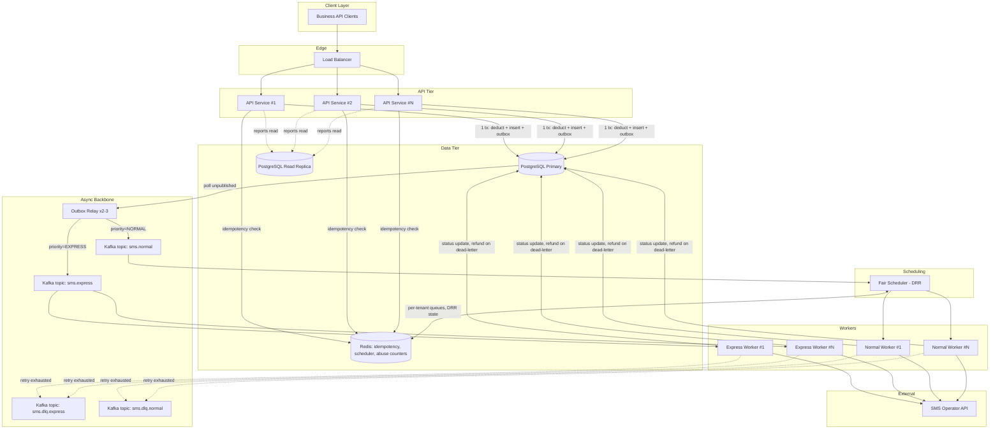
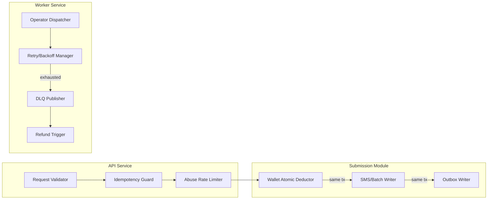
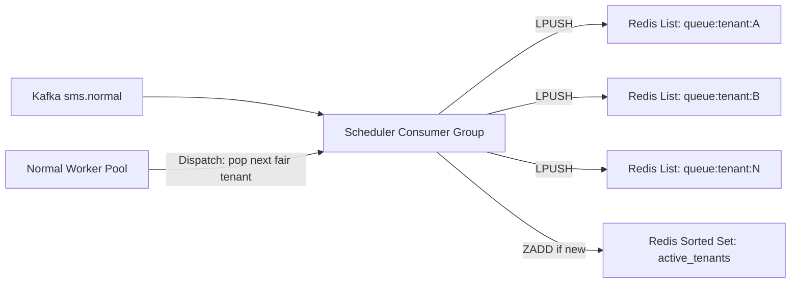

# Architecture

## 1. High-Level Architecture

### Service decomposition

| Service | Responsibility | Statefulness | Scaling axis |
|---|---|---|---|
| **API Service** | HTTP ingress, request validation, idempotency check, abuse-protection rate limiting, delegates to Submission path | Stateless | Horizontal, behind LB |
| **Submission path (Wallet + SMS domain)** | Atomic balance check-and-deduct, SMS/Batch persistence, outbox write — **one DB transaction** | Stateless service, stateful transaction | Scales with API Service; bottlenecked by Postgres primary |
| **Outbox Relay** | Polls unpublished outbox rows, publishes to Kafka, marks published | Stateless (competing consumers via `FOR UPDATE SKIP LOCKED`) | Horizontal (2–3 instances for HA) |
| **Fair Scheduler** | Consumes `sms.normal`, applies Deficit Round Robin across tenants, feeds Normal Workers | Stateful (Redis-backed) | Vertical + Redis Cluster sharding |
| **Express Workers** | Consume `sms.express` directly, dispatch to operator, no scheduling layer | Stateless | Horizontal, sized for SLA headroom |
| **Normal Workers** | Pull from Fair Scheduler, dispatch to operator, retry/backoff | Stateless | Horizontal, autoscaled on queue depth |
| **Reporting path** | Serves `GET` report queries from a read-optimized store | Stateless service / read replica | Horizontal, isolated from OLTP write path |

### Why Wallet and SMS are *not* separate network services on the write path

The requirement "wallet deduction and SMS creation must happen in a single database transaction" is a hard constraint, not a suggestion. If Wallet Service and SMS Service were independent processes with independent DB connections, satisfying that requirement would force a distributed transaction (2PC) or a Saga with compensating actions — both add latency and failure modes to a path that must be **fast and strongly consistent**, since it's money.

**Decision:** Wallet and SMS are separate *domain modules* (distinct packages, distinct tables, independently testable) but execute inside **one Python (FastAPI) service** using **one Postgres transaction** for the write path. They remain separate services conceptually for reporting/read paths, and could be split into network services later behind a **single shared database and Unit-of-Work boundary** if org boundaries demanded it — but not for v1. See [decisions.md](decisions.md) ADR-013.

## 2. Architecture Diagram (Mermaid)



## 3. Component Diagram



## 4. Sequence Diagrams

See [sequence-diagrams.md](sequence-diagrams.md) for Single SMS, Batch SMS, and Express SMS flows.

## 5 & 6. Database Design / ER Diagram

See [database.md](database.md).

## 7. Queue Design

### Topics

| Topic | Partitions | Partition Key | Consumer Group | Retention |
|---|---|---|---|---|
| `sms.express` | 12 (throughput headroom, not fairness) | `tenant_id` | `express-workers` | 24h |
| `sms.normal` | 64 | `tenant_id` | `fair-scheduler` (single logical scheduler, HA via consumer group of 3-5) | 24h |
| `sms.dlq.express` | 6 | `tenant_id` | `dlq-processor` | 30d |
| `sms.dlq.normal` | 6 | `tenant_id` | `dlq-processor` | 30d |

### Why two physically separate topics for Express and Normal, not a priority field

A shared topic with a `priority` field still forces Express messages to sit behind whatever Normal backlog exists in the same partition — Kafka consumers process a partition strictly in offset order; you cannot "jump the queue" within one partition without re-reading and re-filtering, which defeats the purpose of Kafka's sequential read performance and adds unbounded worst-case latency for Express during a Normal traffic spike.

**Physical isolation** (separate topic, separate consumer group, separate worker pool, and in production separate node pool / resource quota) means Express latency is *only* a function of Express volume and Express worker capacity — never a function of what Normal tenants are doing. This is the only design that gives Express a latency SLA independent of Normal load. Full rationale and comparison against alternatives in [decisions.md](decisions.md) ADR-005.

### Why Kafka partitioning alone does not solve fairness

Partitioning `sms.normal` by `tenant_id` gives *coarse* isolation — a heavy tenant hashed onto partition 7 doesn't directly slow down a tenant on partition 40. But with tens of thousands of tenants and 64 partitions, multiple tenants inevitably share a partition, and Kafka consumption within a partition is strict FIFO: a heavy tenant's burst sitting ahead of a light tenant's message in the same partition **will** delay it, with no mechanism to reorder. Increasing partition count to reduce collision probability doesn't eliminate it and doesn't scale (partition counts in the thousands create operational and rebalancing overhead). Partitioning is therefore used here purely for **ingestion throughput and scheduler consumer-group parallelism**, not as the fairness mechanism. Fairness is implemented explicitly — see §8.

### Why Kafka over RabbitMQ for this system

Kafka is chosen because: (1) durable log retention lets the Outbox Relay and Fair Scheduler replay/recover independently without message loss semantics tied to consumer ack timing; (2) partition-based consumer groups give natural horizontal scaling for both Express and Normal worker pools; (3) throughput at 100M msgs/day (~1,160 avg msg/sec, bursting an order of magnitude higher under skew) is comfortably within Kafka's sweet spot, whereas RabbitMQ's per-message routing overhead and classic-queue disk persistence become an operational tuning burden at this volume. RabbitMQ remains a valid substitute if the team has stronger RabbitMQ operational expertise — the topic/exchange topology maps directly (Express = dedicated exchange+queue, Normal = dedicated exchange+queue, DLQ = dead-letter-exchange per queue, which RabbitMQ supports natively via `x-dead-letter-exchange`).

## 8. Scheduling Strategy

### Requirement recap

- No customer starves another because they send more.
- An idle system lets a single heavy customer use 100% of Normal capacity.
- **Not** rate limiting — a heavy customer is never told "no", only "wait your fair turn."

### Chosen design: Deficit Round Robin (DRR) over per-tenant queues, centralized in Redis



**Algorithm** (classic DRR, Shreedhar & Varghese):

1. Every tenant with a non-empty `queue:tenant:{id}` is a member of `active_tenants`.
2. Each round, the scheduler walks `active_tenants` round-robin. On a tenant's turn: `deficit[tenant] += quantum`.
3. While `deficit[tenant] >= cost(next_msg)` and the queue is non-empty: pop and dispatch one message, `deficit[tenant] -= cost(next_msg)`.
4. When a tenant's queue empties: remove it from `active_tenants` and **reset its deficit to 0**.
5. When a new message arrives for a previously-inactive tenant: it re-enters `active_tenants` with `deficit = 0` — it does **not** inherit or accumulate credit while it was silent.

**Why this satisfies both requirements:**

- *No starvation*: every active tenant gets exactly one quantum's worth of service per round, regardless of how deep its backlog is. A tenant with 1M queued messages gets the same per-round share as a tenant with 1 queued message.
- *Full capacity when idle*: if only one tenant is active, round-robin degenerates to "always this tenant's turn" — 100% of Normal Worker capacity flows to it. This falls out of the algorithm for free; no special-case code needed.
- *Step 4 is the key anti-starvation detail*: resetting deficit on queue-empty prevents a bursty-but-usually-idle tenant from banking credit and later dumping a huge burst with elevated priority — it must earn quantum each round like everyone else.

**Why centralized in Redis, not per-partition in-worker:**

An alternative is to let each Kafka consumer instance apply DRR only across the tenants present in its assigned partitions (fully decentralized, no Redis dependency). This was rejected because partition-to-consumer assignment is a coarse, rebalance-driven grouping — fairness would only hold *within* a consumer's partition set, not tenant-to-tenant system-wide. Two heavy tenants who happen to land on partitions owned by the same consumer would compete; two heavy tenants on different consumers would not, producing inconsistent, assignment-dependent fairness. A centralized scheduling ledger (Redis) makes fairness a *global* property, independent of partition/consumer topology — verifiable and simple to reason about. Redis throughput easily covers this: 100M/day peak is on the order of low tens-of-thousands ops/sec, well inside a single Redis primary's ~100K+ ops/sec ceiling, sharded across Redis Cluster if that ever changes.

**Cost/trade-off:** Redis becomes a dependency in the Normal-tier hot path (Express deliberately has none). This is acceptable because Normal tier does not carry a hard latency SLA — a brief Redis blip degrades Normal throughput, it does not violate any promised guarantee. Express is architecturally isolated from this dependency entirely (§7).

### Comparison against alternatives

| Approach | No starvation? | Full capacity when idle? | Notes |
|---|---|---|---|
| **FIFO (single shared queue)** | ❌ | ✅ | A heavy tenant's burst sits ahead of everyone submitted after it — direct violation of "heavy customer cannot starve lighter customer." Simplest to build, wrong semantics for this requirement. |
| **Priority Queue (static tiers)** | ❌ (within a tier) | ✅ | Solves Express-vs-Normal (which is why we *do* use tiering for that split) but does nothing for fairness *within* the Normal tier — two Normal tenants of different volume still compete FIFO within the tier. Doesn't address the actual requirement, which is about volume, not a declared tier. |
| **Rate Limiting (per-tenant cap, e.g. token bucket)** | ✅ (trivially — capped tenants can't dominate) | ❌ | Explicitly disallowed by requirements: a heavy tenant hitting its cap is *rejected/delayed* even when the system is otherwise idle and could serve it immediately. Rate limiting optimizes for protecting the system from a *single* tenant's traffic, not for fairness *between* tenants — it's the wrong tool for this job, though still correct as an **abuse/spike protection** layer at the API tier (see below). |
| **Weighted Fair Queuing / DRR (chosen)** | ✅ | ✅ | Only approach satisfying both constraints simultaneously: fairness is relative to *other active senders*, not an absolute per-tenant ceiling. |

### Where rate limiting *does* belong

Rate limiting is retained at the **API Service** layer, but scoped narrowly to abuse/spike protection, not fairness:

- Per-tenant request-rate ceiling (e.g. token bucket, generous limit like 500 req/sec) to protect the API tier and Postgres primary from a misbehaving client (bug in a customer's retry loop, credential compromise) — this is infrastructure self-defense, not a fairness mechanism, and the ceiling is set high enough that no legitimately well-behaved heavy customer ever hits it under normal operation.
- This is orthogonal to and independent of the DRR fair scheduler, which governs *dispatch order*, not *admission*.

## 9. Wallet Design

See [database.md](database.md) §Wallet Schema for the table design, and [decisions.md](decisions.md) ADR-008 for the optimistic-charge vs. reserve-then-capture trade-off.

**Atomic deduction — the entire mechanism is one statement:**

```sql
UPDATE wallets
SET balance = balance - $cost, updated_at = now()
WHERE tenant_id = $1 AND balance >= $cost
RETURNING balance;
```

If zero rows are returned, balance was insufficient — the transaction aborts, nothing is written, and the API returns `402 Payment Required`. There is **no separate `SELECT balance` step**: combining the check and the write into the `WHERE` clause of the `UPDATE` eliminates the classic check-then-act race (TOCTOU) entirely — the database's row lock provides the serialization for free, because any `UPDATE` on a row implicitly takes a row-level exclusive lock for the duration of the transaction.

**Concurrency behavior:**

- Two concurrent single-SMS requests from the same tenant: the second `UPDATE` blocks on the row lock held by the first until it commits or rolls back, then evaluates its own `balance >= cost` against the *already-updated* balance. No lost updates, no double-spend, no need for `SELECT ... FOR UPDATE` (the plain `UPDATE` already provides equivalent locking).
- Isolation level: `READ COMMITTED` is sufficient — the correctness of this pattern comes from the row lock, not from snapshot isolation, so `SERIALIZABLE` (with its retry-on-conflict overhead) is unnecessary overhead for this specific invariant.
- Batch requests compute `total_cost = recipient_count * unit_cost` once and perform a single atomic `UPDATE`, so a batch of 50,000 recipients is exactly as safe as a batch of 1 — there is no per-recipient deduction loop that could partially succeed.

**Known contention limit:** all writes for one tenant serialize through one row. For an extremely heavy tenant issuing very high *concurrent* (not sequential) single-SMS calls, this row becomes a throughput ceiling (Postgres sustains roughly 1K–5K row-level UPDATEs/sec on a single hot row on typical hardware — far above what any legitimate single-tenant single-SMS call pattern should produce, and batch endpoints exist precisely to collapse N deductions into 1 for bulk senders). If a specific customer's access pattern ever needs to exceed this, wallet balance can be split into N sub-balance shards per tenant with periodic reconciliation — deferred to [decisions.md](decisions.md) Future Improvements, not needed at the stated scale.

**Ledger, not just balance:** every deduction, topup, and refund also inserts an immutable row into `wallet_ledger` in the same transaction. `wallets.balance` is a materialized, fast-to-read cache of "sum of ledger entries" — necessary for a financial system's auditability (dispute resolution, reconciliation jobs, regulatory ask) that a bare balance column cannot provide on its own.

## 10. Transactional Outbox Pattern

**The problem it solves:** the write path must (a) deduct balance, (b) persist the SMS/Batch, and (c) notify the async pipeline (Kafka) so a worker eventually sends it. (a) and (b) are trivially atomic — same Postgres transaction. (c) is a **different system** with its own availability characteristics. Without the outbox pattern, you're forced into a dual-write:

```
BEGIN; deduct + insert; COMMIT;
publish_to_kafka();  -- separate, non-transactional step
```

This has two failure windows: commit succeeds then the process crashes/Kafka is unreachable before publish → **customer is charged, SMS row exists, but it is never queued for sending** (silent loss, the worst possible failure mode for a paid product). Or publish succeeds then the DB commit fails/rolls back → **a message is dispatched that was never actually paid for or persisted**.

**The fix:** write an `outbox_events` row **inside the same transaction** as the wallet deduction and SMS insert (step b above becomes b+c-durable-intent, still one ACID transaction, no cross-system atomicity needed). A separate **Outbox Relay** process polls `outbox_events WHERE published_at IS NULL` (using `SELECT ... FOR UPDATE SKIP LOCKED` so multiple relay instances run concurrently without double-publishing), publishes to Kafka, then marks the row published. If the relay crashes mid-batch, unpublished rows simply remain unpublished and get picked up by the next poll — the operation is naturally idempotent-safe to retry because "publish" is at-least-once and downstream consumers are built to tolerate duplicates (see [Idempotency](#13-idempotency) below, worker-side dedupe).

**Payoff during a Kafka outage:** submissions keep succeeding — money is still deducted safely and durably in Postgres — while the outbox table accumulates a backlog that drains automatically once Kafka recovers. This decouples "can the customer submit SMS" from "is Kafka currently healthy," which is exactly the availability profile we want (see [scalability.md](scalability.md) Failure Scenarios).

**Scaling the relay:** polling is simple and sufficient at this scale (sub-second poll interval, indexed on the partial `published_at IS NULL` index keeps polls cheap even with a large table). A CDC-based relay (Debezium reading the Postgres WAL) is the natural upgrade path if poll latency or DB load from polling ever becomes material — noted in [decisions.md](decisions.md) Future Improvements.

## 11. Retry Strategy

| Tier | Max attempts | Backoff | Rationale |
|---|---|---|---|
| Express | 2 | 200ms, 400ms (tight, fixed) | Retry budget must fit inside the latency SLA; beyond 2 fast attempts, failing fast to DLQ preserves the SLA for everything behind it in the pool |
| Normal | 5 | Exponential with jitter: 500ms × 2^n, capped at 30s | No latency SLA to protect; favor eventual delivery over speed |

- **Retryable** errors: operator timeout, 5xx, network/connection errors — transient by nature.
- **Non-retryable** errors: operator 4xx (invalid number, blocked destination) — retrying cannot change the outcome; the message is marked `FAILED` immediately without consuming retry budget, and (per ADR-012) triggers a refund since the customer was charged for a message that can never be delivered.
- Retries are tracked via message headers (`attempt_count`) on republish to the same topic, not via Kafka's native offset-uncommitted redelivery, so that backoff timing is explicit and controllable rather than tied to consumer poll intervals.

## 12. Dead Letter Queue

After retry exhaustion, the worker publishes the original message plus failure metadata (`error`, `attempt_count`, `first_attempted_at`, `last_attempted_at`) to `sms.dlq.{express|normal}` and sets `sms.status = FAILED_DEAD_LETTER`. A DLQ processor:

1. Updates the report-facing status so the failure is visible to the customer (never silently disappear a paid-for message).
2. Triggers the refund flow (atomic ledger-backed credit-back, itself outbox-published for auditability) — see ADR-012.
3. Retains DLQ messages 30 days for operator-side investigation and manual replay tooling (out of scope for v1, noted as future improvement).

## 13. Idempotency

Every `POST /sms` and `POST /sms/batch` requires an `Idempotency-Key` header.

- **Fast path:** Redis `SET idem:{tenant}:{key} <in-progress> NX PX 30000` — if the key already exists, another request with the same key is in flight or completed; return the cached result (if completed) or `409 Conflict` (if still in-flight).
- **Durable guarantee:** a unique constraint on `(tenant_id, idempotency_key)` in Postgres is the actual source of truth — Redis is a latency optimization and a lock, not the correctness boundary, because Redis failover/restart could theoretically lose the fast-path key. The DB transaction's unique constraint violation is caught and translated to "return prior result," making replay safe even if Redis state is lost.
- Client retries after a network timeout (the classic "did my request go through?" ambiguity) are therefore always safe to resend with the same key — never double-charged, never double-queued.

**Separate concern — worker-side dispatch idempotency:** the Idempotency-Key protects *client submission* retries. It does **not** protect against *internal* redelivery (a worker crashes after calling the operator but before committing its status update, and the message is redelivered to another worker). That is handled independently: before dispatching, a worker checks `sms.status` — if already `SENT_TO_OPERATOR` or terminal, it skips re-dispatch. This is best-effort (a crash between the operator call and the status check read is a real, accepted gap) — SMS delivery is inherently at-least-once at the operator boundary, called out explicitly in [scalability.md](scalability.md) Failure Scenarios rather than hidden.

## 14–16. Logging, Metrics, Health Checks

See [observability.md](observability.md) for logging and metrics, [deployment.md](deployment.md) for health checks.
