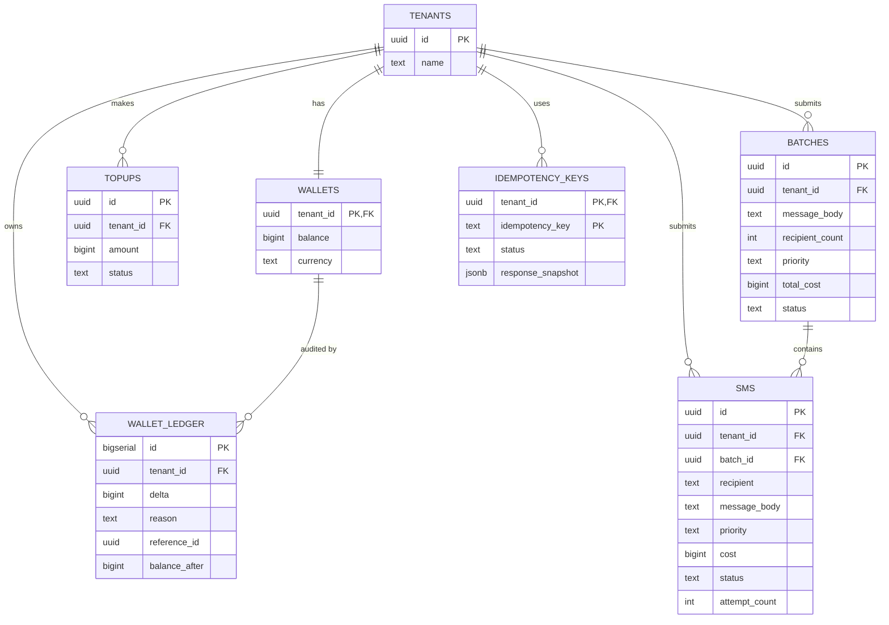

# Database Design

PostgreSQL is the single source of truth for money and message state. Redis and Kafka are never authoritative — they're derived/transport layers reconstructible from Postgres (idempotency, outbox) or Kafka's own log (scheduler state) if lost. See [decisions.md](decisions.md) ADR-001 for the full comparison against alternative datastores.

## Why PostgreSQL

Three requirements shaped this choice, and none of them are individually unusual — the combination is what narrows the field:

1. **Multi-table ACID transactions.** Wallet deduction, SMS/batch insert, and the outbox event must commit as one atomic unit ([decisions.md](decisions.md) ADR-004, ADR-008). This rules out datastores without native multi-row/multi-table transactional guarantees (most NoSQL stores) without reaching for application-level sagas.
2. **Correct, boring concurrency primitives.** The wallet invariant depends on row-level locking behavior that's simple to reason about (§ [Concurrency](#concurrency) below) — not on optimistic conflict resolution or client-side retry loops.
3. **Native support for the specific mechanics this system leans on**: declarative range partitioning (the `sms` table), `SELECT ... FOR UPDATE SKIP LOCKED` (competing-consumer outbox relay), partial indexes (cheap narrow scans on a huge table), and `JSONB` (outbox payloads) — all first-class, mature features, not workarounds.

Postgres's single-primary write ceiling is a real, known trade-off, not an oversight — see [decisions.md](decisions.md) ADR-001 for what we gave up (built-in horizontal write scaling) and [scalability.md](scalability.md) for the tenant-sharding lever that exists for when it matters.

## Design principles

1. **Money is integer minor units, never float.** `balance` and all cost columns are `BIGINT` counts of "SMS credits" (or minor currency unit, e.g. cents). Floating point rounding error is unacceptable in a ledger.
2. **A balance column alone is not auditable.** Every mutation of `wallets.balance` is paired with an immutable `wallet_ledger` row in the same transaction — the ledger is the append-only truth, the balance column is a materialized fast-read cache of `SUM(ledger.delta)`.
3. **`sms` is the largest table by orders of magnitude** (100M rows/day → tens of billions within a year) and must be range-partitioned from day one, not retrofitted later.
4. **Batch content is not duplicated per recipient.** A batch of 1M identical messages stores the body once.

## Schema

```sql
-- Minimal tenant reference. Full auth/tenant management is out of scope,
-- but wallet and sms rows need a stable FK target.
CREATE TABLE tenants (
    id          UUID PRIMARY KEY,
    name        TEXT NOT NULL,
    created_at  TIMESTAMPTZ NOT NULL DEFAULT now()
);

CREATE TABLE wallets (
    tenant_id   UUID PRIMARY KEY REFERENCES tenants(id),
    balance     BIGINT NOT NULL DEFAULT 0 CHECK (balance >= 0),
    currency    TEXT NOT NULL DEFAULT 'credits',
    updated_at  TIMESTAMPTZ NOT NULL DEFAULT now()
);

-- Append-only audit trail. Never UPDATEd or DELETEd.
CREATE TABLE wallet_ledger (
    id            BIGSERIAL PRIMARY KEY,
    tenant_id     UUID NOT NULL REFERENCES tenants(id),
    delta         BIGINT NOT NULL,             -- negative for deduction, positive for topup/refund
    reason        TEXT NOT NULL CHECK (reason IN ('TOPUP','SMS_DEDUCT','REFUND')),
    reference_id  UUID NOT NULL,               -- topup id / sms id / batch id
    balance_after BIGINT NOT NULL,
    created_at    TIMESTAMPTZ NOT NULL DEFAULT now()
);
CREATE INDEX idx_ledger_tenant_time ON wallet_ledger (tenant_id, created_at);

CREATE TABLE topups (
    id          UUID PRIMARY KEY,
    tenant_id   UUID NOT NULL REFERENCES tenants(id),
    amount      BIGINT NOT NULL CHECK (amount > 0),
    method_ref  TEXT,                          -- external payment reference
    status      TEXT NOT NULL DEFAULT 'COMPLETED',
    created_at  TIMESTAMPTZ NOT NULL DEFAULT now()
);

CREATE TABLE batches (
    id              UUID PRIMARY KEY,
    tenant_id       UUID NOT NULL REFERENCES tenants(id),
    message_body    TEXT NOT NULL,
    recipient_count INT NOT NULL CHECK (recipient_count > 0),
    priority        TEXT NOT NULL CHECK (priority IN ('NORMAL','EXPRESS')),
    unit_cost       BIGINT NOT NULL,
    total_cost      BIGINT NOT NULL,
    status          TEXT NOT NULL DEFAULT 'ACCEPTED'
                    CHECK (status IN ('ACCEPTED','IN_PROGRESS','COMPLETED','PARTIALLY_FAILED','FAILED')),
    created_at      TIMESTAMPTZ NOT NULL DEFAULT now()
);
CREATE INDEX idx_batches_tenant_time ON batches (tenant_id, created_at);

-- Partitioned by created_at (monthly range partitions), declared natively.
-- Single-SMS rows: batch_id NULL, message_body set directly.
-- Batch-child rows: batch_id set, message_body NULL -> inherit from batches.message_body
--   (storage optimization: a 1M-recipient batch stores the body once, not 1M times).
CREATE TABLE sms (
    id                  UUID NOT NULL,
    tenant_id           UUID NOT NULL REFERENCES tenants(id),
    batch_id            UUID REFERENCES batches(id),
    recipient           TEXT NOT NULL,          -- E.164
    message_body        TEXT,                   -- NULL when batch_id is set
    priority            TEXT NOT NULL CHECK (priority IN ('NORMAL','EXPRESS')),
    cost                BIGINT NOT NULL,
    status              TEXT NOT NULL DEFAULT 'QUEUED'
                        CHECK (status IN ('QUEUED','SENT_TO_OPERATOR','DELIVERED','FAILED','FAILED_DEAD_LETTER')),
    attempt_count       INT NOT NULL DEFAULT 0,
    last_error          TEXT,
    operator_message_id TEXT,
    created_at          TIMESTAMPTZ NOT NULL DEFAULT now(),
    updated_at          TIMESTAMPTZ NOT NULL DEFAULT now(),
    sent_at             TIMESTAMPTZ,
    PRIMARY KEY (id, created_at)                -- created_at included: required by native partitioning
) PARTITION BY RANGE (created_at);

CREATE TABLE sms_2026_07 PARTITION OF sms
    FOR VALUES FROM ('2026-07-01') TO ('2026-08-01');
-- new partition created ahead of month boundary by a scheduled job; old partitions
-- detached/archived per retention policy (see Scalability doc).

CREATE INDEX idx_sms_tenant_time ON sms (tenant_id, created_at);
CREATE INDEX idx_sms_batch ON sms (batch_id);
CREATE INDEX idx_sms_status_pending ON sms (status) WHERE status IN ('QUEUED','SENT_TO_OPERATOR');

-- Transactional outbox.
CREATE TABLE outbox_events (
    id            BIGSERIAL PRIMARY KEY,
    aggregate_type TEXT NOT NULL,               -- 'sms' | 'batch' | 'wallet'
    aggregate_id  UUID NOT NULL,
    event_type    TEXT NOT NULL,                -- 'SmsAccepted' | 'BatchAccepted' | 'WalletRefunded'
    payload       JSONB NOT NULL,
    partition_key UUID NOT NULL,                -- tenant_id, used as Kafka message key
    topic         TEXT NOT NULL,
    published_at  TIMESTAMPTZ,
    attempts      INT NOT NULL DEFAULT 0,
    created_at    TIMESTAMPTZ NOT NULL DEFAULT now()
);
-- Partial index: relay only ever scans unpublished rows, stays cheap regardless of table growth.
CREATE INDEX idx_outbox_unpublished ON outbox_events (created_at) WHERE published_at IS NULL;

CREATE TABLE idempotency_keys (
    tenant_id        UUID NOT NULL,
    idempotency_key  TEXT NOT NULL,
    request_hash     TEXT NOT NULL,             -- detects same-key/different-body client bug -> 422
    resource_type    TEXT NOT NULL,              -- 'sms' | 'batch'
    resource_id      UUID,
    status           TEXT NOT NULL DEFAULT 'IN_PROGRESS' CHECK (status IN ('IN_PROGRESS','COMPLETED')),
    response_snapshot JSONB,
    created_at       TIMESTAMPTZ NOT NULL DEFAULT now(),
    expires_at       TIMESTAMPTZ NOT NULL,
    PRIMARY KEY (tenant_id, idempotency_key)
);
```

### Why batch fan-out doesn't insert to `outbox_events` per recipient

A naive design inserts one `outbox_events` row per `sms` row. For a batch of 1M recipients, that's 1M rows in a single transaction — large transaction, large WAL write, long lock duration, and a huge relay publish burst. Instead: the transaction inserts **one** `outbox_events` row of `event_type = 'BatchAccepted'` referencing `batch_id`. The relay publishes that single event; a downstream fan-out step reads `sms WHERE batch_id = $1` in paginated chunks and emits the individual per-recipient dispatch messages onto `sms.express`/`sms.normal`. This bounds transaction size to O(1) regardless of batch size, at the cost of the fan-out consumer doing a read it otherwise wouldn't — see [decisions.md](decisions.md) ADR-007.

## Foreign keys

| FK | Direction | Enforced? | Rationale |
|---|---|---|---|
| `wallets.tenant_id → tenants.id` | 1:1 | Yes | A tenant without a wallet is a bug state, not a valid transient one — wallet is provisioned at tenant creation. |
| `wallet_ledger.tenant_id → tenants.id` | N:1 | Yes | Ledger rows must always resolve to a real tenant for audit purposes. |
| `topups.tenant_id → tenants.id` | N:1 | Yes | Same reasoning as ledger. |
| `batches.tenant_id → tenants.id` | N:1 | Yes | |
| `sms.tenant_id → tenants.id` | N:1 | Yes | |
| `sms.batch_id → batches.id` | N:1, nullable | Yes | `NULL` for single-send rows; enforced when present so a child row can never reference a nonexistent batch. |
| `outbox_events.aggregate_id → (sms/batches/wallet_ledger).id` | N:1, logical only | **No** | Deliberately not a DB-enforced FK — see below. |

**Why `outbox_events` has no enforced FK to its aggregate:** the table must stay writable for aggregate types added later without a migration touching a constraint, and rows are deleted/archived independently of their source aggregate's lifecycle (an outbox row can legitimately outlive or be purged before/after its source row's own retention cycle). Enforcing referential integrity here would couple two independent lifecycle policies (message retention on `sms`, plumbing retention on `outbox_events`) that have no reason to move together. `aggregate_id`/`aggregate_type` are a logical reference, validated at write time by application code, not by the schema.

All enforced FKs use the default `NO ACTION` — cascading deletes are never appropriate here (a tenant is never hard-deleted while it has ledger/SMS history; deactivation is a status flag, not a row deletion, though tenant lifecycle management itself is out of scope — see [assumptions.md](assumptions.md)).

## Transactions

The write path's entire correctness rests on exactly two transaction shapes:

**Submission (single SMS or batch):**
```sql
BEGIN;
UPDATE wallets SET balance = balance - $cost, updated_at = now()
  WHERE tenant_id = $1 AND balance >= $cost
  RETURNING balance;
-- 0 rows => ROLLBACK, return 402
INSERT INTO sms (...) VALUES (...);              -- or batches + bulk sms insert
INSERT INTO wallet_ledger (...) VALUES (...);
INSERT INTO outbox_events (...) VALUES (...);      -- exactly one row, even for a batch
COMMIT;
```

**Refund (DLQ landing):**
```sql
BEGIN;
UPDATE wallets SET balance = balance + $refund, updated_at = now()
  WHERE tenant_id = $1
  RETURNING balance;
INSERT INTO wallet_ledger (delta = +refund, reason = 'REFUND') VALUES (...);
UPDATE sms SET status = 'FAILED_DEAD_LETTER' WHERE id = $2;
INSERT INTO outbox_events (event_type = 'WalletRefunded') VALUES (...);  -- optional, for downstream billing/notification consumers
COMMIT;
```

Both shapes share a property: **every observable side effect of accepting or reversing a charge lives in one transaction.** There is no code path where the wallet moves without a corresponding ledger row, and no code path where an `sms`/`batch` row exists without either a successful deduction or a successful refund having already committed. Workers updating delivery status (`SENT_TO_OPERATOR`, `DELIVERED`, `FAILED`) are simpler single-row updates outside this boundary — they don't touch money, so they don't need transactional bundling with anything else.

## Isolation level

`READ COMMITTED` — Postgres's default — is sufficient for every transaction in this system, including the wallet deduction. This is a deliberate, not a default-by-omission, choice: `SERIALIZABLE`'s value is preventing anomalies that arise from two transactions each reading a consistent snapshot and then writing based on stale reads. The wallet deduction doesn't have that shape — it never reads-then-decides in application code. The `WHERE balance >= $cost` check is evaluated by Postgres itself at `UPDATE` time against the current row state under the row's own lock, so there is no snapshot-staleness window for `SERIALIZABLE` to protect against here. Using `SERIALIZABLE` would add retry-on-serialization-failure handling to every write for a guarantee the access pattern doesn't need — pure overhead. See [Concurrency](#concurrency) below for why the row lock alone is sufficient.

## Concurrency

**The mechanism — one statement, no separate read:**

```sql
UPDATE wallets
SET balance = balance - $cost, updated_at = now()
WHERE tenant_id = $1 AND balance >= $cost
RETURNING balance;
```

If zero rows are returned, balance was insufficient — the transaction aborts, nothing is written, and the API returns `402 Payment Required`. There is no separate `SELECT balance` step: combining the check and the write into the `UPDATE`'s `WHERE` clause eliminates the classic check-then-act race (TOCTOU) entirely, because any `UPDATE` on a row implicitly takes a row-level exclusive lock for the duration of the transaction — the database's own locking provides the serialization, no explicit `SELECT ... FOR UPDATE` needed.

**Concurrent-request behavior:** two simultaneous single-SMS requests from the same tenant serialize automatically — the second `UPDATE` blocks on the row lock held by the first until it commits or rolls back, then evaluates its own `balance >= cost` against the *already-updated* balance. No lost updates, no double-spend possible by construction.

**Batch requests** compute `total_cost = recipient_count * unit_cost` once and perform a single atomic `UPDATE` — a batch of 50,000 recipients is exactly as safe as a batch of 1, because there is no per-recipient deduction loop that could partially succeed and leave the wallet in an inconsistent state relative to what was actually persisted.

**Known contention limit:** all writes for one tenant serialize through one row. Commodity Postgres sustains roughly 1K-5K row-level `UPDATE`/sec on a single hot row — far above any legitimate single-tenant single-SMS call pattern, and the batch endpoint exists precisely to collapse N deductions into 1 for bulk senders. If a specific tenant's access pattern ever needs to exceed this, wallet balance can be split into N sub-balance shards per tenant with periodic reconciliation — a deferred lever, not needed at stated scale (see [scalability.md](scalability.md)).

## Atomic wallet update

See [Concurrency](#concurrency) above for the mechanism and [decisions.md](decisions.md) ADR-008 for the full alternatives comparison (reserve-then-capture, naive check-then-act). The short version: charge is optimistic (deducted at submission, before delivery is confirmed), with an automatic compensating refund on permanent delivery failure ([decisions.md](decisions.md) ADR-012). This trades a small window of user-facing balance inaccuracy (between charge and eventual refund on a message that will fail) for avoiding reservation-state tracking and its expiry semantics — justified because delivery outcomes resolve in seconds to low minutes, not the long-held-reservation timeframes where reserve-then-capture earns its complexity.

**Ledger, not just balance:** every deduction, topup, and refund also inserts an immutable row into `wallet_ledger` in the same transaction. `wallets.balance` is a materialized, fast-to-read cache of "sum of ledger entries" — necessary for a financial system's auditability (dispute resolution, reconciliation jobs, regulatory ask) that a bare balance column cannot provide on its own. If `wallets.balance` and `SUM(wallet_ledger.delta)` for a tenant ever disagree, that's a P1 incident, not a reconciliation nuance — the ledger is the ground truth and the balance column is derived, even though it's the balance column that's read on the hot path for performance.

## Outbox table

`outbox_events` is the mechanism that makes the write path's async signal durable without a distributed transaction — see [Why the transactional outbox is needed](queue.md#why-the-transactional-outbox-is-needed) in [queue.md](queue.md) for the full problem/solution narrative, and [decisions.md](decisions.md) ADR-004 for the alternatives comparison. From a database-design perspective specifically: the table is intentionally generic (`aggregate_type`/`aggregate_id`/`event_type`/`payload` rather than one column per event shape) so new event types don't require a schema migration, and the partial index on `published_at IS NULL` keeps the relay's poll query cheap indefinitely regardless of how large the table grows, since published rows (the overwhelming majority over time) never enter that index.

## ER Diagram



`outbox_events` is intentionally excluded from the ER diagram's FK graph — see [Foreign keys](#foreign-keys) above for why.

## Indexing & query patterns

| Query | Index used | Notes |
|---|---|---|
| Report list by tenant, paginated by time | `idx_sms_tenant_time` | Served from read replica, not primary; backs cursor pagination ([decisions.md](decisions.md) ADR-011) directly |
| Batch detail → child SMS | `idx_sms_batch` | |
| Worker/ops: find stuck `QUEUED`/`SENT_TO_OPERATOR` rows | `idx_sms_status_pending` (partial) | Partial index keeps this cheap even as terminal-state rows dominate the table |
| Outbox relay poll | `idx_outbox_unpublished` (partial) | Same reasoning — index only ever covers the small unpublished slice |
| Idempotency lookup | PK `(tenant_id, idempotency_key)` | Point lookup |

Every partial index in this schema follows the same principle: the query that uses it only ever cares about a small, bounded slice of a huge table (unpublished outbox rows, in-flight SMS), so the index is built to cover exactly that slice rather than the whole table — keeping both index size and write-amplification proportional to the active working set, not total historical volume.

## Partitioning & retention

`sms` partitions monthly by `created_at`. At ~3B rows/month, monthly partitions keep individual partition size manageable for autovacuum and index maintenance. A scheduled job creates the next month's partition ahead of the boundary; a retention job detaches and archives (to cold storage / object storage as Parquet) partitions older than the contractual retention window (e.g. 13 months), then drops them — `DROP` on a detached partition is instant, versus a `DELETE` which would be catastrophic at this row count. See [scalability.md](scalability.md) Partitioning for how this interacts with tenant-based sharding as a separate, orthogonal scaling axis.
