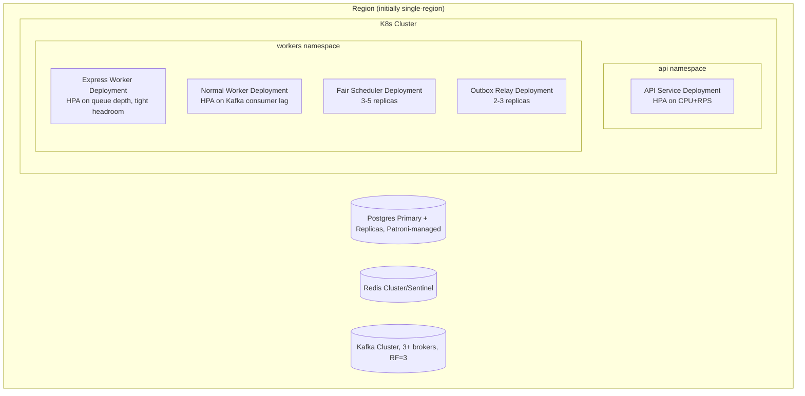

# Deployment

How this system is packaged, configured, and operated — local dev up through rolling production deploys. Logging and metrics have their own document: [observability.md](observability.md). Component responsibilities are in [architecture.md](architecture.md).

## Docker Compose (local development)

Local dev runs every dependency as a container and every service as a local process or container, wired by one compose file. This is not a production topology — no HA, no replicas, single-broker Kafka — it exists purely to make `docker compose up` produce a working end-to-end pipeline for development and integration testing.

```yaml
services:
  postgres:
    image: postgres:16-alpine
    environment:
      POSTGRES_DB: sms_gateway
      POSTGRES_USER: postgres
      POSTGRES_PASSWORD: postgres
    volumes: ["pgdata:/var/lib/postgresql/data"]
    healthcheck:
      test: ["CMD-SHELL", "pg_isready -U postgres"]
      interval: 5s
      timeout: 5s
      retries: 10

  redis:
    image: redis:7-alpine
    healthcheck:
      test: ["CMD", "redis-cli", "ping"]
      interval: 5s
      timeout: 5s
      retries: 10

  kafka:
    image: apache/kafka:3.8.0        # KRaft mode, no ZooKeeper
    environment:
      KAFKA_NODE_ID: 1
      KAFKA_PROCESS_ROLES: broker,controller
      KAFKA_LISTENERS: PLAINTEXT://:9092,CONTROLLER://:9093
      KAFKA_ADVERTISED_LISTENERS: PLAINTEXT://kafka:9092
      KAFKA_CONTROLLER_QUORUM_VOTERS: 1@kafka:9093
      KAFKA_CONTROLLER_LISTENER_NAMES: CONTROLLER
      # Single-broker local dev — RF=1 so __consumer_offsets can actually be
      # created (the 3-broker-cluster default leaves every consumer group
      # unable to find a coordinator).
      KAFKA_OFFSETS_TOPIC_REPLICATION_FACTOR: 1
      KAFKA_TRANSACTION_STATE_LOG_REPLICATION_FACTOR: 1
      KAFKA_TRANSACTION_STATE_LOG_MIN_ISR: 1
    healthcheck:
      test: ["CMD-SHELL", "/opt/kafka/bin/kafka-broker-api-versions.sh --bootstrap-server localhost:9092"]
      interval: 10s
      timeout: 5s
      retries: 5

  migrate:
    build: { context: ., dockerfile: docker/Dockerfile.migrate }
    env_file: .env
    depends_on:
      postgres: { condition: service_healthy }

  api:
    build: { context: ., dockerfile: docker/Dockerfile.api }
    env_file: .env
    depends_on:
      migrate: { condition: service_completed_successfully }
      postgres: { condition: service_healthy }
      redis: { condition: service_healthy }
      kafka: { condition: service_healthy }
    ports: ["8080:8080"]

  outbox-relay:
    build: { context: ., dockerfile: docker/Dockerfile.outbox-relay }
    env_file: .env
    depends_on:
      migrate: { condition: service_completed_successfully }
      postgres: { condition: service_healthy }
      kafka: { condition: service_healthy }

  fair-scheduler:
    build: { context: ., dockerfile: docker/Dockerfile.fair-scheduler }
    env_file: .env
    depends_on:
      migrate: { condition: service_completed_successfully }
      redis: { condition: service_healthy }
      kafka: { condition: service_healthy }

  express-worker:
    build: { context: ., dockerfile: docker/Dockerfile.express-worker }
    env_file: .env
    depends_on:
      migrate: { condition: service_completed_successfully }
      postgres: { condition: service_healthy }
      kafka: { condition: service_healthy }

  normal-worker:
    build: { context: ., dockerfile: docker/Dockerfile.normal-worker }
    env_file: .env
    depends_on:
      migrate: { condition: service_completed_successfully }
      postgres: { condition: service_healthy }
      redis: { condition: service_healthy }
      kafka: { condition: service_healthy }

volumes:
  pgdata:
```

Each service is its own Python package/image (`api`, `outbox-relay`, `fair-scheduler`, `express-worker`, `normal-worker`), each with a dedicated entrypoint module and no runtime tier flag — this mirrors how they're deployed and scaled independently in production ([architecture.md](architecture.md) service decomposition table) and catches accidental cross-service coupling early, in dev, rather than in a K8s manifest review. A one-shot `migrate` service (`alembic upgrade head`) runs the schema forward before any other service starts, replacing what a Go build would have done via a `cmd/migrate` binary.

## Production deployment

Production runs on Kubernetes; the compose topology above maps directly onto namespaced Deployments:



- Express and Normal worker pools are **separate Deployments with separate resource requests/limits and separate HPA policies** — the concrete infrastructure expression of physical tier isolation ([decisions.md](decisions.md) ADR-005). They must never share a node pool under resource pressure in a way that lets Normal-tier load steal CPU/network from Express pods; a dedicated node pool or resource-quota-guaranteed namespace for Express is the production hardening step beyond just separate Deployments.
- Postgres HA via Patroni (leader election + fencing) — fencing is what prevents split-brain double-writes during a network partition, not merely "having a replica" (see [scalability.md](scalability.md) Failure Scenarios).
- Every service ships as an independently versioned, independently deployable image — a worker rollout never requires an API rollout and vice versa, consistent with the service decomposition in [architecture.md](architecture.md).

## Environment variables

Configuration is entirely environment-variable driven — no config files baked into images, so the same image is promoted unchanged from staging to production with only its environment differing.

| Variable | Services | Purpose |
|---|---|---|
| `DATABASE_URL` | api, relay, workers | Postgres primary connection string (via PgBouncer in production) |
| `DATABASE_READ_URL` | api | Read-replica connection string, used only for `GET` report/status queries |
| `REDIS_URL` | api, scheduler | Redis connection string (idempotency locks, DRR state) |
| `KAFKA_BROKERS` | relay, scheduler, workers | Comma-separated bootstrap broker list |
| `KAFKA_TOPIC_EXPRESS` / `KAFKA_TOPIC_NORMAL` | relay, scheduler, workers | Topic names, environment-suffixed (e.g. `sms.express.prod`) to keep environments isolated on a shared cluster if used |
| `OPERATOR_API_URL` / `OPERATOR_API_TIMEOUT_MS` | workers | Operator endpoint and per-call timeout, tuned independently per tier |
| `IDEMPOTENCY_KEY_TTL_SECONDS` | api | Redis lock TTL for in-flight idempotency keys (default 30s) |
| `RATE_LIMIT_RPS` | api | Default per-tenant abuse-protection ceiling (see [security.md](security.md)) |
| `LOG_LEVEL` | all | `debug`/`info`/`warn`/`error` — `debug` never enabled in production |
| `SHUTDOWN_GRACE_PERIOD_SECONDS` | all | Upper bound for graceful shutdown drain (see below) |

There is no `WORKER_TIER` variable: tier selection moved from a runtime env var read by one shared worker binary to build-time image selection — `express-worker` and `normal-worker` are separate Python packages/images with their own entrypoint and hardwired settings, so there's no runtime branch to misconfigure.

Variables are validated at process startup, not lazily on first use — a service with a missing or malformed required variable fails its liveness probe immediately rather than serving degraded traffic and failing confusingly on the first request that needs the missing config.

## Configuration

Beyond environment variables, per-tenant and per-tier tunables (rate-limit ceilings, DRR quantum size, retry backoff parameters) are read from a small `config` table in Postgres with an in-process cache refreshed on a short interval (tens of seconds), rather than requiring a redeploy to change a single tenant's rate limit. This is deliberately not a general-purpose feature-flag system — it covers the specific operational knobs this system needs to adjust without a deploy, not an extensible configuration framework built ahead of need.

## Secrets

Database credentials, Redis auth (if enabled), and the operator API credential are never environment variables in plaintext in production — they're mounted from the cluster secret store (Kubernetes Secrets backed by an external secrets manager, e.g. Vault or a cloud KMS-backed secret store) as files or injected via a secrets-CSI-driver-mounted volume, not baked into the Deployment manifest or image. `.env` in the Docker Compose example above is explicitly a **local-dev-only** convenience and must never be the pattern used in a shared or production environment. See [security.md](security.md) Secrets Management for the full policy, including rotation.

## Health checks

Standard Kubernetes-shaped liveness/readiness split, applied per service:

| Endpoint | Checks | Used for |
|---|---|---|
| `/healthz` (liveness) | Process responsive, no deadlock | Restart decision — deliberately shallow, must not depend on external systems |
| `/readyz` (readiness) | Postgres ping, Redis ping (API/Scheduler only), Kafka broker metadata fetch | Load-balancer admission (API Service) / rolling-deploy sequencing (all services) |

### Readiness

- **API Service:** readiness gates LB traffic — a pod that can't reach Postgres should stop receiving traffic, not `500` on every request it does receive.
- **Worker services:** not behind an LB, but readiness still gates rolling deploys (don't roll a new worker version into rotation until it can reach Kafka + Postgres) and feeds autoscaler decisions — a not-ready pod shouldn't count toward "capacity" for scale-down math, or the autoscaler could scale down real capacity based on a pod that isn't actually serving.

### Liveness

Liveness deliberately **excludes** dependency checks. A liveness probe that pings Postgres and fails when Postgres is briefly degraded causes every pod cluster-wide to restart simultaneously — a self-inflicted cascading outage on top of whatever caused the original Postgres blip. Liveness only answers "is this process's own event loop responsive," which is the only question a restart can actually fix; anything downstream is readiness's job, not liveness's.

## Graceful shutdown

Every service handles `SIGTERM` by entering a drain state before exiting, bounded by `SHUTDOWN_GRACE_PERIOD_SECONDS`:

- **API Service:** immediately fails readiness (stops receiving new LB traffic) while allowing in-flight requests to complete normally, including their DB transaction — a request already inside the wallet-deduction transaction must be allowed to commit or roll back cleanly, never killed mid-transaction.
- **Outbox Relay / Fair Scheduler / Workers:** stop pulling new work (stop polling the outbox table / stop consuming new Kafka messages) but finish processing whatever's already in hand — a worker mid-dispatch to the operator finishes that call and commits its status update before exiting, rather than abandoning a call whose outcome is now unknown.
- If the grace period expires before drain completes, the process is killed regardless — any message left genuinely in-flight at that point is simply redelivered by Kafka on rebalance, which the system already tolerates by design (at-least-once delivery, [queue.md](queue.md) Exactly-once vs at-least-once).

Graceful shutdown is what makes rolling deploys and autoscale-driven pod termination safe by default rather than a source of dropped requests or duplicate operator calls beyond the already-accepted at-least-once gap.

## Rolling updates

Standard Kubernetes rolling update (`maxUnavailable`/`maxSurge`), gated entirely by the readiness probes above — no custom deployment orchestration needed. The sequence for any service: new pod starts → passes readiness (dependencies reachable) → old pod receives `SIGTERM` → old pod drains (§ Graceful shutdown) → old pod terminates. Because every service is stateless between requests/messages (§ [scalability.md](scalability.md) Stateless APIs), a rolling update carries zero state-migration risk — the only thing that matters is that draining pods finish in-flight work cleanly, which graceful shutdown guarantees.

Database and Kafka schema/topic changes are deployed independently of application rollouts and must be backward-compatible with both the old and new application version for the duration of the rollout window (standard expand/contract migration discipline) — a rolling deploy that pairs a breaking schema change with the application change that depends on it will have a window where old pods run against new schema, which is a self-inflicted outage, not a Kubernetes limitation.
