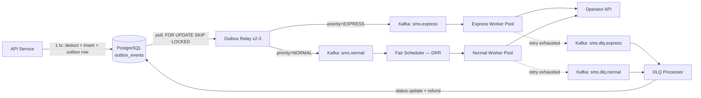
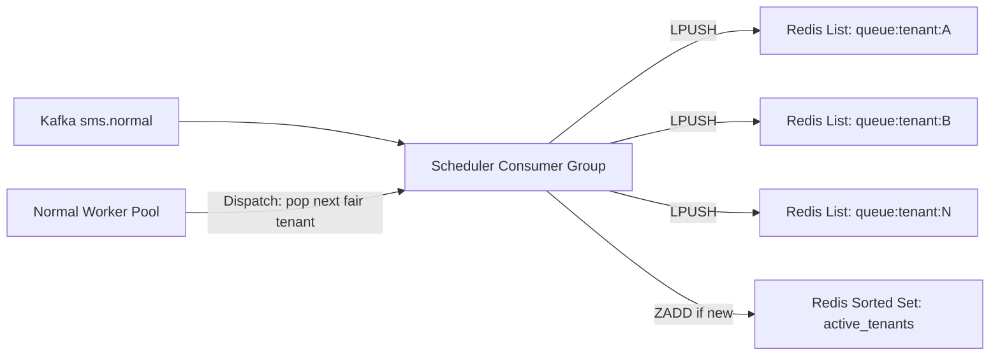

# Messaging Architecture

The async backbone that moves an accepted SMS from "charged and persisted" to "dispatched to the operator." This document is the deep-dive on the mechanics; see [architecture.md](architecture.md) §7-13 for how it fits the rest of the system and [decisions.md](decisions.md) for why each piece is shaped this way.

## End-to-end pipeline

Nothing in this pipeline is a single point of failure for **submission**: the API's write path only ever touches Postgres. Everything from the relay onward is decoupled async infrastructure that can be down without blocking a customer's ability to submit and pay for an SMS — see [scalability.md](scalability.md) Failure Scenarios.

## Why a relay instead of publishing directly from the API

The API could, in principle, call the Kafka producer directly inside the request handler after the transaction commits. This was rejected: it reintroduces the dual-write problem the transactional outbox exists to eliminate ([decisions.md](decisions.md) ADR-004) — a crash or Kafka outage between commit and publish silently loses the message while the customer has already been charged. The relay decouples "the transaction committed" from "the message is in Kafka" into two independently retryable steps, with the durable intent (`outbox_events` row) surviving in Postgres regardless of Kafka's state at commit time.

## Topics

| Topic | Partitions | Partition Key | Consumer Group | Retention |
|---|---|---|---|---|
| `sms.express` | 12 (throughput headroom, not fairness) | `tenant_id` | `express-workers` | 24h |
| `sms.normal` | 64 | `tenant_id` | `fair-scheduler` (single logical scheduler, HA via consumer group of 3-5) | 24h |
| `sms.dlq.express` | 6 | `tenant_id` | `dlq-processor` | 30d |
| `sms.dlq.normal` | 6 | `tenant_id` | `dlq-processor` | 30d |

Partitioning by `tenant_id` gives ingestion-throughput parallelism and keeps one tenant's messages in relative order within a partition — it is **not** the fairness mechanism (see [Fair Scheduler](#fair-scheduler) below). 24h retention on live topics is enough to absorb a multi-hour outage anywhere downstream without losing data; 30d on DLQ topics supports post-incident investigation and manual replay.

## Normal Queue

`sms.normal` carries the bulk of traffic with no latency SLA attached. Its job is to get every accepted message delivered eventually, fairly, without one tenant's volume degrading another's wait time. It never talks to workers directly — every message passes through the Fair Scheduler first.

## Express Queue

`sms.express` is physically separate end-to-end: its own topic, its own consumer group, its own worker pool, and in production its own Kubernetes Deployment with independently guaranteed resources ([deployment.md](deployment.md)). Express workers consume directly — there is no scheduling layer between the topic and dispatch, because Express carries exactly one tenant's messages at a time in effect (no cross-tenant fairness concern at Express's assumed low volume share — see [assumptions.md](assumptions.md)) and because inserting *any* shared component here would make the latency SLA a function of what else is happening on that shared component.

**Why a separate topic and not a priority field on one topic:** Kafka consumes a partition in strict offset order. A `priority` field on a shared topic still leaves Express messages sitting behind whatever Normal backlog occupies the same partition ahead of them — a consumer can't reorder within a partition without re-reading and filtering, which defeats sequential-read performance and produces unbounded worst-case Express latency during a Normal traffic spike. Physical separation is the only construction where Express latency is provably a function of Express volume and Express capacity alone. Full comparison in [decisions.md](decisions.md) ADR-005.

## Fair Scheduler

**Algorithm — Deficit Round Robin (Shreedhar & Varghese):**

1. Every tenant with a non-empty `queue:tenant:{id}` is a member of `active_tenants`.
2. Each round, the scheduler walks `active_tenants` round-robin. On a tenant's turn: `deficit[tenant] += quantum`.
3. While `deficit[tenant] >= cost(next_msg)` and the queue is non-empty: pop and dispatch one message, `deficit[tenant] -= cost(next_msg)`.
4. When a tenant's queue empties: remove it from `active_tenants` and **reset its deficit to 0**.
5. A newly-active tenant enters at `deficit = 0` — it never inherits credit from a period of inactivity.

Step 4 is the anti-abuse detail: without it, a bursty-but-usually-idle tenant could bank credit while silent and later dump a large burst with elevated effective priority. Resetting on empty forces every tenant to earn its quantum fresh, every round.

**Why this satisfies both fairness requirements:** every *active* tenant gets exactly one quantum's worth of service per round regardless of backlog depth (no starvation — a 1M-message backlog and a 1-message backlog get equal per-round share), and if only one tenant is active, round-robin degenerates to "always this tenant's turn," so it gets 100% of Normal capacity for free, no special-case code required.

**Why centralized in Redis, not decentralized per-consumer:** a decentralized design (each Kafka consumer applies DRR only across tenants in its own assigned partitions) makes fairness dependent on Kafka's rebalance-driven partition-to-consumer assignment — two heavy tenants landing on the same consumer's partitions compete, two on different consumers don't, an inconsistent guarantee. Centralizing scheduling state in Redis makes fairness a global, verifiable property independent of partition topology. Full alternatives comparison in [decisions.md](decisions.md) ADR-006.

**Cost:** Redis becomes a hot-path dependency for Normal-tier dispatch — a cost Express deliberately doesn't pay (see Express Queue above). Acceptable because Normal carries no hard latency SLA; a Redis blip degrades throughput, it doesn't violate a promise.

## Worker Pool

Express and Normal each run an independently deployed, independently scaled worker pool ([deployment.md](deployment.md)). A worker's loop is the same shape in both tiers:

1. Receive a message (direct Kafka consume for Express; DRR dispatch for Normal).
2. Check `sms.status` — if already terminal or `SENT_TO_OPERATOR`, skip (internal-redelivery idempotency guard, see [Exactly-once vs at-least-once](#exactly-once-vs-at-least-once)).
3. Call the operator API.
4. On success: update `sms.status = SENT_TO_OPERATOR`, `sent_at = now()`.
5. On failure: classify retryable vs. non-retryable and act per the retry strategy below.

Workers are stateless between messages — no in-memory queue, no batching buffer that could be lost on crash — so a worker crash mid-message loses at most the one in-flight message, which Kafka redelivers to a surviving consumer on rebalance.

## Retry Queue

There is no separate physical "retry queue" topic — retries are republished to the *same* topic (`sms.normal` or `sms.express`) with an incremented `attempt_count` header, not relying on Kafka's native offset-uncommitted redelivery. This keeps backoff timing explicit and controllable in application code rather than tied to consumer poll-interval behavior, which would make backoff timing an accident of consumer configuration rather than a deliberate policy.

| Tier | Max attempts | Backoff | Rationale |
|---|---|---|---|
| Express | 2 | 200ms, 400ms (tight, fixed) | Retry budget must fit inside the latency SLA; beyond 2 fast attempts, failing fast to DLQ protects the SLA for everything queued behind it in the pool |
| Normal | 5 | Exponential with jitter: 500ms × 2^n, capped at 30s | No latency SLA to protect; favor eventual delivery over speed |

- **Retryable:** operator timeout, 5xx, network/connection errors — transient by nature.
- **Non-retryable:** operator 4xx (invalid number, blocked destination) — retrying cannot change the outcome. The message is marked `FAILED` immediately without consuming retry budget, and (per [decisions.md](decisions.md) ADR-012) triggers a refund since the customer was charged for a message that can never be delivered.

## Dead Letter Queue

After retry exhaustion, a worker publishes the original message plus failure metadata (`error`, `attempt_count`, `first_attempted_at`, `last_attempted_at`) to `sms.dlq.{express|normal}` and sets `sms.status = FAILED_DEAD_LETTER`. A DLQ processor:

1. Updates the customer-visible status — a paid-for message never silently disappears.
2. Triggers an automatic, idempotency-guarded refund via the same atomic-ledger mechanism as any other wallet credit.
3. Retains the message 30 days for operator-side investigation and manual replay (replay tooling itself is out of scope for v1 — see [assumptions.md](assumptions.md)).

Full rationale for automatic refund vs. alternatives in [decisions.md](decisions.md) ADR-012.

## Ordering guarantees

- **Within a Kafka partition:** strict FIFO by design — this is what makes physical topic separation the only viable mechanism for Express isolation (§ [Express Queue](#express-queue)).
- **Within one tenant, Normal tier:** *not* strictly guaranteed end-to-end. `tenant_id` partition keying keeps one tenant's messages largely together, but DRR dispatch interleaves a tenant's messages with every other active tenant's messages by design — that interleaving *is* fairness. A tenant should not assume message N is dispatched before message N+1 simply because it was submitted first; retries can also reorder relative to fresh submissions from the same tenant.
- **Across tenants:** no ordering guarantee, nor should there be — tenants are independent senders with no cross-tenant ordering relationship in the domain.
- **Batch children:** the fan-out consumer paginates `sms WHERE batch_id = ?` and enqueues in that scan order, but dispatch order from there on is subject to the same DRR interleaving as any other Normal-tier message — a batch is atomic at *acceptance*, not at *dispatch ordering* (see [decisions.md](decisions.md) ADR-007 and [sequence-diagrams.md](sequence-diagrams.md) Batch SMS).

If a future requirement needs strict per-tenant ordering guarantees end-to-end, that is a materially different design (single-partition-per-tenant dispatch, no DRR interleaving) and would need to be reconciled against the fairness requirement, which fundamentally requires interleaving active tenants' messages.

## Exactly-once vs. at-least-once

Kafka can provide exactly-once *processing* semantics internally (idempotent producer + transactional consumer), but the operator API call is an external HTTP side effect outside Kafka's transactional boundary — Kafka cannot make a third-party HTTP call exactly-once, full stop. Chasing exactly-once *within* Kafka would add real overhead (transactional producer/consumer coordination) without closing the actual gap, which is the external call.

**Decision: accept at-least-once delivery to the operator**, mitigated — not eliminated — by a worker-side status check before dispatch (§ [Worker Pool](#worker-pool) step 2). The accepted, narrow gap: a worker crash between the operator call succeeding and the status-commit landing can still produce a duplicate send to the end recipient. This is called out explicitly rather than falsely promised as exactly-once — see [decisions.md](decisions.md) ADR-006 in the prior numbering / current cross-reference in [scalability.md](scalability.md) Failure Scenarios.

This is a **different** idempotency mechanism from the client-facing `Idempotency-Key` (§ [decisions.md](decisions.md) ADR-009): the client key protects against *client submission* retries; the worker status check protects against *internal Kafka redelivery*. They address different failure domains and are deliberately not conflated into one mechanism.

## Why the transactional outbox is needed

Restating the core problem this pipeline depends on solving, because everything above assumes it: the write path must deduct balance, persist the SMS, and durably signal the async pipeline, and these three things must not be allowed to disagree. A dual-write (`COMMIT`, then separately `publish_to_kafka()`) has two failure windows — commit-then-crash-before-publish (customer charged, message never queued, silent loss) and publish-then-rollback (a message dispatches for a charge that never landed). Both are unacceptable for a paid product.

The transactional outbox closes this by making "durably queued for publish" part of the same ACID transaction as the charge and the SMS insert — no cross-system atomicity is required, because there's only one system (Postgres) in the atomic boundary. Publishing to Kafka becomes a separately retryable, idempotent-safe step that can fail and retry indefinitely without ever putting the charge/persist decision at risk. Full mechanism and relay implementation in [decisions.md](decisions.md) ADR-004 and [database.md](database.md) `outbox_events`.
