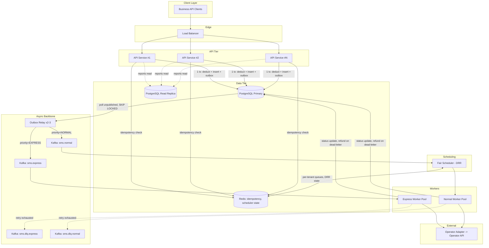
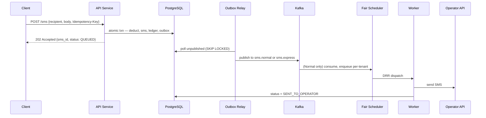
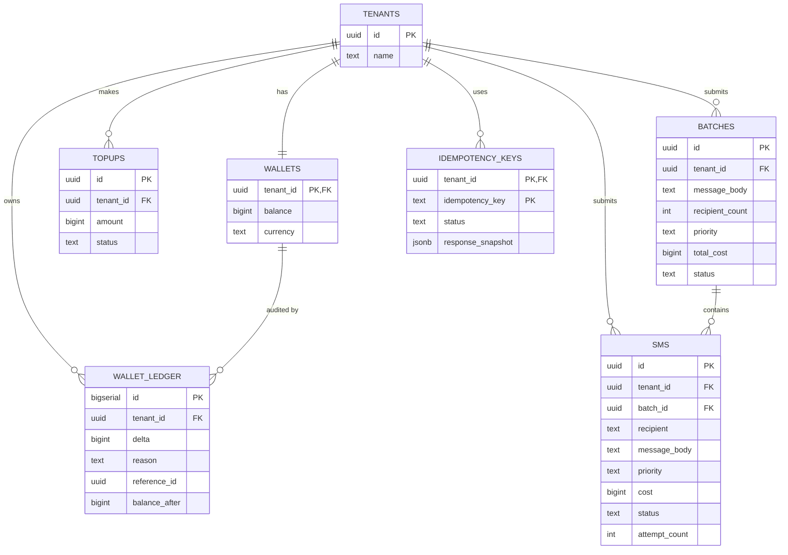
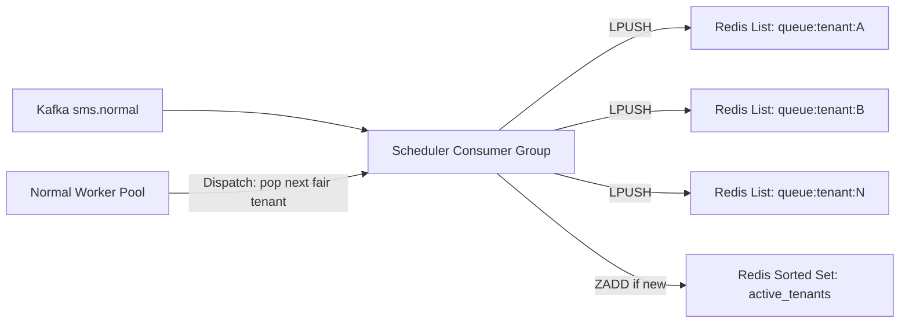
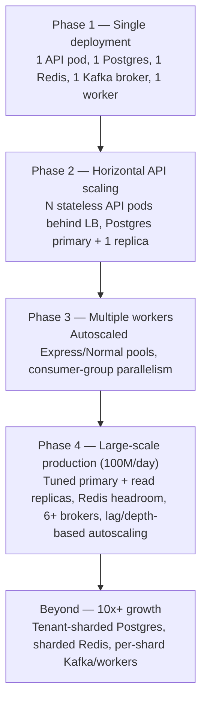

# RFC: SMS Gateway System Design

| | |
|---|---|
| **RFC** | 0001 |
| **Status** | Proposed |
| **Author** | Platform Engineering |
| **Reviewers** | TBD (Backend, Infra, Billing) |
| **Created** | 2026-07-09 |
| **Related docs** | [architecture.md](../architecture.md) · [decisions.md](../decisions.md) · [database.md](../database.md) · [queue.md](../queue.md) · [api.md](../api.md) · [scalability.md](../scalability.md) · [security.md](../security.md) · [observability.md](../observability.md) · [assumptions.md](../assumptions.md) · [sequence-diagrams.md](../sequence-diagrams.md) · [deployment.md](../deployment.md) · [testing.md](../testing.md) |

This RFC proposes the system design for a multi-tenant SMS Gateway. It is the review artifact — the supporting docs listed above contain the full mechanism-level detail and ADR-style alternatives analysis; this document is the condensed case for sign-off, cross-referencing that detail rather than duplicating it.

---

## 1. Summary

We propose building a multi-tenant SMS Gateway that accepts SMS submissions (single and batch) from business customers ("tenants"), meters usage against a prepaid wallet, and dispatches messages to a third-party operator API for delivery.

- **Problem:** Tenants need a way to send transactional and bulk SMS through our platform with accurate, race-free billing and predictable delivery behavior, at a volume where naive designs (synchronous dispatch, unpartitioned tables, FIFO queues) fail under load or under multi-tenant contention.
- **Users:** Business API clients (tenants) integrating server-to-server; internal billing/reconciliation tooling consuming the wallet ledger; internal operators/on-call consuming metrics and dashboards.
- **Main capabilities:** single SMS submission, batch SMS submission, wallet top-up and balance query, SMS/batch status and history reporting, and a latency-guaranteed Express tier alongside a best-effort Normal tier with fair inter-tenant scheduling.
- **Expected scale:** 100M SMS/day (~1,157 msg/sec average), with traffic skewed such that a handful of heavy tenants sustain bursts an order of magnitude above the mean while a long tail of tenants contributes negligible individual load. The design is sized against this skew, not against the average.

## 2. Motivation

We need a system of record for a paid, metered service where the two failure modes that matter most — charging a customer without doing the work, and doing the work without charging the customer — must both be structurally impossible, not merely unlikely. Ad hoc SMS-sending scripts or a naive CRUD service satisfy neither: they either read-then-write balance (a race under concurrency) or dispatch before confirming payment (revenue leakage).

**Business requirements:**
- Never send an SMS the tenant hasn't paid for; never fail to refund a tenant for an SMS that was charged but never delivered.
- Support both ad hoc single sends (OTPs, alerts) and bulk sends (marketing-style batches to tens of thousands of recipients) as first-class, differently-shaped operations.
- Offer a premium low-latency tier (Express) as a differentiated product capability, with a guarantee that holds independent of how much Normal-tier traffic is in flight.
- Treat every tenant as economically independent: one tenant's volume must never degrade another's service.

**Technical challenges:**
- Atomic balance check-and-deduct under concurrent requests, without a distributed transaction across services.
- Durably bridging a synchronous, money-touching write path to an asynchronous delivery pipeline without a dual-write gap.
- Fair capacity allocation across tens of thousands of tenants with wildly skewed volume, where neither FIFO (starves light tenants) nor rate limiting (rejects heavy tenants when the system is otherwise idle) satisfies the requirement.
- A hard latency SLA for one traffic class that must not degrade as a function of a different, un-related traffic class's load.
- A single largest table (`sms`) growing into the billions of rows within a year, requiring partitioning and retention strategy designed in from day one, not retrofitted.

## 3. Goals

- **High throughput:** sustain 100M SMS/day average with headroom for order-of-magnitude tenant-level bursts.
- **Reliable SMS submission:** every accepted submission is durably persisted and guaranteed to reach the async dispatch pipeline — no silent loss between "charged" and "queued."
- **Accurate billing:** every wallet mutation is atomic, race-free, and independently auditable via an append-only ledger.
- **Balance consistency:** `wallets.balance` and `SUM(wallet_ledger.delta)` must never disagree; a divergence is a P1 incident, not a reconciliation nuance.
- **Express SMS latency guarantees:** Express dispatch latency must be provably a function of Express volume and Express capacity alone, independent of Normal-tier load.
- **Fair resource allocation:** no tenant can starve another by sending more, and a lone active tenant gets full available capacity — both properties simultaneously, not traded off against each other.
- **Operational observability:** every invariant this system claims (no negative balance, Express SLA, fairness) must be independently measurable in production, not just asserted at design time.

## 4. Non-Goals

- **User/tenant authentication and identity management.** Every service trusts an already-resolved `tenant_id` in request context; login, credential issuance, and identity-provider integration are explicitly upstream of this system (see [assumptions.md](../assumptions.md) #1).
- **SMS delivery receipts (DLR) from carriers/handsets.** `SENT_TO_OPERATOR` is the terminal success proxy for v1; true carrier delivery confirmation is a deferred feature (see [assumptions.md](../assumptions.md) Deferred features).
- **Marketing campaign management** (scheduling, audience segmentation, A/B content, opt-out/compliance workflows beyond raw send). This system is a delivery and billing substrate, not a campaign platform.
- **Multi-region deployment.** v1 targets a single region with a single Postgres primary topology; multi-region is a documented future lever (§16, §22), not built here.
- **Operator selection/routing logic.** The operator is treated as a single black-box `OperatorClient`; multi-operator routing is a future improvement (§22).
- **Pricing engine / rate cards.** Cost is assumed resolved to an integer credit amount before the atomic deduction; how that integer is computed (tiered pricing, discounts) is out of scope.

## 5. Requirements

**Functional Requirements**
- Send a single SMS (`POST /sms`), synchronously charged, asynchronously dispatched.
- Send a batch SMS to many recipients as one atomic accept/reject decision (`POST /sms/batch`).
- Wallet management: balance query, top-up, automatic refund on permanent delivery failure.
- SMS/batch status and history reporting, filterable and paginated, isolated from the OLTP write path.
- Express SMS: a distinct priority tier with an independent latency SLA.

**Non-Functional Requirements**
- Sustain 100M SMS/day with skewed tenant load (§scale envelope, [scalability.md](../scalability.md)).
- High availability for the submission path; degrade gracefully, not silently, when a dependency is down.
- Horizontal scalability on every stateless tier; a documented, non-hypothetical lever for the one stateful bottleneck (Postgres primary writes).
- Fault tolerance: no single dependency failure (Kafka, Redis, a worker) can silently lose a paid-for message or corrupt a balance.
- Full observability of every stated invariant: throughput, queue latency, worker processing time, failure rate, wallet-rejection rate, fairness (per-tenant wait time distribution).

## 6. System Constraints and Assumptions

Full list with impact-if-wrong analysis lives in [assumptions.md](../assumptions.md); the load-bearing ones for this RFC:

- **One SMS equals one credit charge**, with cost resolved to an integer before the atomic deduction — pricing logic itself is out of scope.
- **All SMS messages are single-page.** Content-length validation at intake rejects over-length messages rather than silently segmenting them; multi-page/concatenated SMS is a schema and pricing change, not an architecture change, if it's ever needed.
- **Persian and English cost the same** — a pricing decision, not an encoding claim; GSM-7 vs. UCS-2 still affects the technical single-page character limit enforced at intake.
- **Authentication is handled externally**; every service trusts a resolved `tenant_id`.
- **The operator integration is abstracted** behind an `OperatorClient` interface and treated as unreliable (can time out, 5xx, or 4xx) — no operator-side idempotency is assumed, which is the source of the accepted at-least-once delivery gap (§11).
- **Single region for v1.**
- **A permanently failed, paid-for message is refunded automatically** — the only defensible behavior for a paid product; not stated in any prompt, an explicit design choice.
- **Batch recipient lists are bounded** by a configured maximum per request; larger sends are the client's responsibility to split.
- **Express volume is assumed a minority of total traffic** (<5–10%) — this drives capacity sizing, not the isolation architecture, which holds regardless of Express's actual share.
- **Report reads are eventually consistent**, served from a replica, never the primary.

## 7. Proposed Architecture

**Service decomposition:**

| Service | Responsibility | Statefulness | Scaling axis |
|---|---|---|---|
| API Service | HTTP ingress, validation, idempotency check, abuse-rate limiting, delegates to Submission path | Stateless | Horizontal behind LB |
| Wallet + SMS Module (Submission path) | Atomic balance check-and-deduct, SMS/Batch persistence, outbox write — one DB transaction | Stateless service, stateful transaction | Scales with API; bottlenecked by Postgres primary |
| Batch Module | Batch entity lifecycle, fan-out of batch children into individual dispatch units | Stateless | Horizontal |
| Outbox Relay | Polls unpublished outbox rows, publishes to Kafka, marks published | Stateless (competing consumers via `FOR UPDATE SKIP LOCKED`) | Horizontal, 2–3 instances for HA |
| Fair Scheduler | Consumes `sms.normal`, applies Deficit Round Robin across tenants | Stateful (Redis-backed) | Vertical + Redis Cluster sharding |
| Worker Service (Express / Normal pools) | Dispatches to the Operator Adapter, handles retry/backoff, DLQ landing | Stateless | Horizontal, independently autoscaled per tier |
| Operator Adapter | Abstracts the third-party operator HTTP API behind `OperatorClient` | Stateless | Scales with worker pool |
| PostgreSQL | System of record for wallet, SMS, batch, outbox, idempotency state | Stateful | Vertical + read replicas; tenant-sharded at 10x+ growth |
| Redis | Idempotency locks, Fair Scheduler state — explicitly non-authoritative | Stateful, reconstructible | Redis Cluster sharding if needed |
| Message Broker (Kafka) | Durable async transport between outbox and workers | Stateful | Partition + broker count |

**Why Wallet and SMS are not separate network services on the write path:** the requirement that wallet deduction and SMS creation commit atomically is a hard constraint. Splitting them into independent microservices with independent DB connections would force a distributed transaction (2PC) or a Saga on a path that must be fast and strongly consistent, since it is money. Wallet and SMS are separate *domain modules* — distinct packages, distinct tables, independently testable — but execute inside one Python (FastAPI) service using one Postgres transaction. Full rationale in [decisions.md](../decisions.md) ADR-013.



Full component/module breakdown and rationale: [architecture.md](../architecture.md).

## 8. Request Flow

### Single SMS Flow

Client → API → Wallet Validation → SMS Creation → Outbox → Queue → Worker → Operator.



Full step-by-step with idempotency and rollback branches: [sequence-diagrams.md](../sequence-diagrams.md) Single SMS.

### Batch SMS Flow

- **Batch creation:** `batches` is a first-class table with its own PK, `total_cost`, and status lifecycle (`ACCEPTED → IN_PROGRESS → COMPLETED | PARTIALLY_FAILED | FAILED`). Child `sms` rows reference `batch_id` and store `message_body = NULL`, inheriting content from the parent — a 1M-recipient batch stores the message body once, not once per recipient.
- **Atomic balance checking:** `total_cost = recipient_count * unit_cost` is computed once and checked/deducted in a single atomic `UPDATE`. A batch of 50,000 recipients is exactly as safe as a batch of 1 — there is no per-recipient deduction loop that could partially succeed.
- **SMS record creation:** all child `sms` rows are bulk-inserted in the same transaction as the deduction.
- **Queue publishing:** the transaction writes exactly **one** `outbox_events` row (`event_type = BatchAccepted`), not one per recipient — this bounds transaction size to O(1) regardless of batch size. A downstream fan-out consumer reads `sms WHERE batch_id = ?` in paginated chunks and emits individual dispatch messages onto `sms.express`/`sms.normal`.

Rationale for batch as a first-class entity vs. correlation-only child rows: [decisions.md](../decisions.md) ADR-007. Full sequence: [sequence-diagrams.md](../sequence-diagrams.md) Batch SMS.

### Express SMS Flow

- **Dedicated queue:** `sms.express` is a physically separate Kafka topic from `sms.normal` — separate partitions, separate consumer group, separate worker pool.
- **Priority handling:** Express workers consume directly with no scheduling layer between the topic and dispatch. There is no priority field on a shared topic — Kafka consumes a partition in strict offset order, so a priority field would still leave Express sitting behind whatever Normal backlog occupies the same partition ahead of it.
- **Latency guarantees:** because Express shares no component with Normal (not a partition, not a consumer group, not even the DRR Redis ledger), Express latency is provably a function of Express volume and Express capacity alone — independently load-testable: saturating Normal should not move Express's latency profile.

Full rationale: [decisions.md](../decisions.md) ADR-005. Full sequence: [sequence-diagrams.md](../sequence-diagrams.md) Express SMS.

## 9. Data Model

**Main entities:**
- **Customer (`tenants`):** minimal reference row; full identity/auth management is out of scope, but wallet and SMS rows need a stable FK target.
- **Wallet (`wallets`):** one row per tenant, `balance BIGINT CHECK (balance >= 0)`. Money is always integer minor units, never float.
- **Wallet Transaction (`wallet_ledger`):** append-only, immutable audit trail — every deduction, top-up, and refund inserts a row here in the same transaction as the balance mutation. `wallets.balance` is a materialized fast-read cache of `SUM(ledger.delta)`; the ledger, not the balance column, is the ground truth for disputes and reconciliation.
- **SMS Batch (`batches`):** owns `total_cost`, `recipient_count`, and an aggregate status lifecycle recomputed asynchronously from child rows.
- **SMS Message (`sms`):** range-partitioned monthly by `created_at` — the largest table by orders of magnitude (~3B rows/month at target scale). Single-send rows have `batch_id = NULL`; batch children inherit body from the parent batch.
- **Outbox Event (`outbox_events`):** the transactional-outbox mechanism — generic `aggregate_type`/`aggregate_id`/`event_type`/`payload` shape so new event types don't require a migration; a partial index on `published_at IS NULL` keeps the relay's poll cheap regardless of table growth.



`outbox_events` is intentionally excluded from this ER graph — it has no enforced FK to its source aggregate by design (its retention lifecycle is independent of the aggregate's own retention). Full schema, indexing, and FK rationale: [database.md](../database.md).

## 10. Consistency Model

**Wallet consistency and atomic balance deduction — the entire mechanism is one statement:**

```sql
UPDATE wallets
SET balance = balance - $cost, updated_at = now()
WHERE tenant_id = $1 AND balance >= $cost
RETURNING balance;
```

If zero rows are returned, balance was insufficient — the transaction aborts, nothing is written, and the API returns `402 Payment Required`. There is no separate `SELECT balance` step: folding the check into the `UPDATE`'s `WHERE` clause eliminates the classic check-then-act (TOCTOU) race entirely, because any `UPDATE` implicitly takes a row-level exclusive lock for the duration of the transaction — Postgres's own locking provides the serialization, with no explicit `SELECT ... FOR UPDATE` needed.

**Database transactions:** the write path performs exactly two transaction shapes — submission (deduct + insert SMS/batch + insert ledger + insert one outbox row, all-or-nothing) and refund (credit + ledger + status update + optional outbox row). Every observable side effect of accepting or reversing a charge lives inside one of these two transactions; there is no code path where a balance moves without a corresponding ledger row.

**Isolation level:** `READ COMMITTED` — Postgres's default — is sufficient, including for the wallet deduction. This is a deliberate choice, not a default-by-omission: `SERIALIZABLE`'s value is preventing anomalies from two transactions each reading a stale snapshot and writing based on it. The wallet deduction never reads-then-decides in application code — the `WHERE balance >= $cost` predicate is evaluated by Postgres itself at `UPDATE` time under the row's own lock, so there is no snapshot-staleness window for `SERIALIZABLE` to protect against here, and its retry-on-conflict overhead would be pure cost with no corresponding benefit.

**Race conditions and concurrent requests:** two simultaneous single-SMS requests from the same tenant serialize automatically — the second `UPDATE` blocks on the row lock held by the first until it commits or rolls back, then evaluates its own `balance >= cost` against the *already-updated* balance. No lost updates, no double-spend, by construction rather than by convention. Batch requests compute `total_cost` once and issue a single atomic `UPDATE`, so a 50,000-recipient batch is exactly as safe as a batch of 1.

**Why the system must never accept SMS without enough balance:** this is the platform's core financial invariant — accepting a send without adequate balance means either delivering an unpaid-for service (direct revenue loss) or having to claw back / dispute a charge after the fact (worse for the tenant relationship and for billing-system integrity than simply never accepting the request). Because the check-and-deduct is a single atomic statement rather than an application-level read-then-write, this invariant holds under arbitrary concurrency without additional locking logic anywhere else in the codebase — it is structurally guaranteed by the database, not by application discipline. `balance BIGINT CHECK (balance >= 0)` is a second, defense-in-depth backstop at the schema level.

**Known contention limit:** all writes for one tenant serialize through one row. Commodity Postgres sustains roughly 1K–5K row-level `UPDATE`/sec on a single hot row — far above any legitimate single-tenant single-SMS call pattern, and the batch endpoint exists precisely to collapse N deductions into 1 for bulk senders. If a tenant's access pattern ever needs to exceed this, sub-balance sharding within a tenant is a documented, deferred lever (§16).

Full mechanism, concurrency test coverage, and alternatives comparison (reserve-then-capture, naive check-then-act): [database.md](../database.md) Concurrency, [decisions.md](../decisions.md) ADR-008, [testing.md](../testing.md) Concurrency tests.

## 11. Messaging Architecture

**Message broker choice:** Kafka, over RabbitMQ. Durable log retention lets the Outbox Relay and Fair Scheduler replay/recover independently of consumer-ack timing; partition-based consumer groups give natural horizontal scaling for both worker pools; throughput at 100M/day (~1,157 avg msg/sec, bursting an order of magnitude higher under skew) sits comfortably in Kafka's operating envelope, whereas RabbitMQ's per-message routing overhead and classic-queue disk persistence become an operational tuning burden at this volume. RabbitMQ remains a legitimate substitute if the team's operational expertise favors it — the topic/exchange topology maps directly (Express = dedicated exchange+queue, Normal = dedicated exchange+queue, DLQ = per-queue dead-letter-exchange, natively supported). Full comparison: [decisions.md](../decisions.md) ADR-003.

**Queue structure:**

| Topic | Partitions | Partition Key | Consumer Group | Retention |
|---|---|---|---|---|
| `sms.express` | 12 (throughput headroom, not fairness) | `tenant_id` | `express-workers` | 24h |
| `sms.normal` | 64 | `tenant_id` | `fair-scheduler` (HA via consumer group of 3–5) | 24h |
| `sms.dlq.express` | 6 | `tenant_id` | `dlq-processor` | 30d |
| `sms.dlq.normal` | 6 | `tenant_id` | `dlq-processor` | 30d |

Partitioning by `tenant_id` gives ingestion-throughput parallelism and keeps one tenant's messages loosely ordered within a partition — it is explicitly **not** the fairness mechanism (§12), since multiple tenants inevitably share a partition at this tenant cardinality, and Kafka consumption within a partition is strict FIFO.

**Consumer model:** Express workers consume `sms.express` directly. Normal-tier consumption is mediated by the Fair Scheduler, which reads `sms.normal`, materializes per-tenant queues in Redis, and feeds Normal workers in DRR order (§12). The Fair Scheduler itself runs as a consumer group of 3–5 instances purely for availability — DRR state is centralized in Redis regardless of which instance reads a given partition, so a scheduler crash triggers a Kafka rebalance with no manual intervention and no message loss (offsets commit only after successful hand-off to Redis).

**Retry:** retries are republished to the same topic with an incremented `attempt_count` header, not left to Kafka's native offset-uncommitted redelivery — this keeps backoff timing explicit and controllable rather than an accident of consumer poll-interval configuration.

| Tier | Max attempts | Backoff | Rationale |
|---|---|---|---|
| Express | 2 | 200ms, 400ms (tight, fixed) | Retry budget must fit inside the latency SLA; beyond 2 fast attempts, failing fast to DLQ protects the SLA for everything queued behind it |
| Normal | 5 | Exponential with jitter: 500ms × 2^n, capped 30s | No latency SLA to protect; favor eventual delivery over speed |

Retryable: operator timeout, 5xx, network errors. Non-retryable: operator 4xx (invalid number, blocked destination) — these fail immediately without consuming retry budget and trigger a refund (§15, ADR-012).

**Dead Letter Queue:** after retry exhaustion, the original message plus failure metadata (`error`, `attempt_count`, timestamps) publishes to `sms.dlq.{express|normal}`, and `sms.status` transitions to `FAILED_DEAD_LETTER`. A DLQ processor updates customer-visible status, triggers an automatic idempotency-guarded refund, and retains the message 30 days for investigation and manual replay (replay tooling itself is a future improvement, §22).

**Delivery guarantees — at-most-once / at-least-once / exactly-once trade-offs:** Kafka can provide exactly-once *processing* internally (idempotent producer + transactional consumer), but the operator API call is an external HTTP side effect outside Kafka's transactional boundary — Kafka cannot make a third-party HTTP call exactly-once, full stop. Chasing exactly-once within Kafka would add real coordination overhead without closing the actual gap. We accept **at-least-once delivery to the operator**, mitigated (not eliminated) by a worker-side `sms.status` check before dispatch: a worker that finds the message already `SENT_TO_OPERATOR` skips re-dispatch. The narrow, accepted gap is a worker crash between "operator call succeeded" and "status commit landed," which can still duplicate a send to the end recipient — called out explicitly rather than falsely promised away. At-most-once was never on the table: silently dropping a message on any transient failure is unacceptable for a paid product with a wallet already debited.

This is a distinct mechanism from the client-facing `Idempotency-Key` (§14): the client key protects against *client submission* retries; the worker status check protects against *internal Kafka redelivery*. Full detail: [queue.md](../queue.md).

## 12. Fair Scheduling Design

**Why simple FIFO is insufficient:** a single shared queue means a heavy tenant's burst sits ahead of every message submitted after it by any other tenant, in strict arrival order. This is a direct violation of "a heavy tenant cannot starve a lighter one" — FIFO is the simplest possible design and the wrong semantics for this requirement.

**Why customer rate limiting is not the main fairness mechanism:** a per-tenant token bucket trivially prevents starvation (a capped tenant can't dominate), but it explicitly fails the second requirement — a heavy tenant hitting its cap is rejected or delayed *even when the system is otherwise idle and could serve it immediately*. Rate limiting optimizes for protecting the system from a single tenant's traffic, not for fairness *between* tenants; it is the wrong tool for this specific job, though it remains correct and retained as an **abuse/spike protection** layer at the API tier (§14, §17) — a generous per-tenant ceiling (e.g. 500 req/sec) that protects the API tier and Postgres primary from a buggy retry loop or a compromised credential, orthogonal to and independent of the fairness mechanism below.

**Requirements the scheduler must satisfy simultaneously:**
- Allow a single customer to consume all available capacity when nobody else is active.
- Prevent heavy customers from starving smaller customers.
- Provide fair resource allocation under contention — fairness relative to *other currently active senders*, not an absolute per-tenant ceiling.

**Comparison of approaches:**

| Approach | No starvation? | Full capacity when idle? | Notes |
|---|---|---|---|
| FIFO (single shared queue) | ❌ | ✅ | Simplest to build; a heavy burst blocks everyone submitted after it. Wrong semantics. |
| Priority Queue (static tiers) | ❌ (within a tier) | ✅ | Solves Express-vs-Normal (which is why we do use it for that split) but does nothing for fairness *within* a tier — two Normal tenants of different volume still compete FIFO within the tier. |
| Rate Limiting (token bucket per tenant) | ✅ (trivially) | ❌ | Explicitly disallowed: a capped tenant is throttled even when the system is idle. Right tool for abuse protection, wrong tool for fairness. |
| Round Robin (plain, no deficit tracking) | Partial | ✅ | Every active tenant gets a turn, but a fixed-size turn per tenant either wastes capacity on small messages or unfairly favors tenants sending large messages, depending on how "turn" is defined — doesn't account for per-message cost variance. |
| Weighted Fair Queuing / Deficit Round Robin (chosen) | ✅ | ✅ | Only approach satisfying both constraints simultaneously; fairness is relative to currently active senders, with cost-aware quantum accounting. |

**Selected approach: Deficit Round Robin (DRR), centralized in Redis.**



Algorithm (classic Shreedhar & Varghese DRR):

1. Every tenant with a non-empty `queue:tenant:{id}` is a member of `active_tenants`.
2. Each round, the scheduler walks `active_tenants` round-robin; on a tenant's turn, `deficit[tenant] += quantum`.
3. While `deficit[tenant] >= cost(next_msg)` and the queue is non-empty: pop and dispatch one message, `deficit[tenant] -= cost(next_msg)`.
4. When a tenant's queue empties, it is removed from `active_tenants` and **its deficit resets to 0**.
5. A newly-active tenant enters at `deficit = 0` — it never inherits credit from a period of inactivity.

Step 4 is the key anti-abuse detail: without it, a bursty-but-usually-idle tenant could bank credit while silent and later dump a large burst with elevated effective priority. Every tenant earns its quantum fresh, every round.

**Why this satisfies both requirements:** every active tenant gets exactly one quantum's worth of service per round regardless of backlog depth — a 1M-message backlog and a 1-message backlog receive equal per-round share, so no starvation. If only one tenant is active, round-robin degenerates to "always this tenant's turn," so it receives 100% of Normal capacity for free, with no special-case code.

**Why centralized in Redis, not decentralized per Kafka consumer:** a decentralized design (each consumer applies DRR only across tenants in its own assigned partitions) makes fairness dependent on Kafka's rebalance-driven, coarse partition-to-consumer assignment — two heavy tenants landing on the same consumer's partitions compete; two on different consumers don't, an inconsistent, topology-dependent guarantee. Centralizing scheduling state in Redis makes fairness a global, verifiable property independent of partition/consumer topology, at the cost of a hot-path Redis dependency for Normal-tier dispatch — acceptable because Normal carries no hard latency SLA (a Redis blip degrades throughput, it doesn't violate a promise), unlike Express, which is architecturally isolated from this dependency entirely (§13).

Full algorithm, Redis data model, and alternatives comparison: [queue.md](../queue.md) Fair Scheduler, [architecture.md](../architecture.md) §8, [decisions.md](../decisions.md) ADR-006.

## 13. Express SMS Design

**Why Express must be isolated:** the latency guarantee must hold *regardless of Normal-tier load*. If Express shared any component with Normal — the same topic, the same consumer group, or even the same DRR ledger with a "priority weight" — a large enough Normal surge could still add queueing delay to Express through resource contention on that shared component (CPU, Redis round-trips, consumer lag). Full physical separation is the only construction where Express latency is provably a function of Express volume and Express capacity alone.

**Queue separation:** dedicated Kafka topic (`sms.express`), dedicated consumer group (`express-workers`), 12 partitions sized for throughput headroom (Express is assumed <5–10% of total volume, §6) rather than for fairness — there is no cross-tenant fairness concern at Express's assumed low volume share, so no scheduling layer sits between the topic and dispatch.

**Worker separation:** a dedicated worker pool, independently deployed and independently scaled (autoscaled on queue depth, not consumer lag — the autoscaler must react before a latency SLA is at risk, not after). In production this extends to a separate Kubernetes Deployment with its own resource requests/limits and, ideally, a dedicated node pool, so Normal-tier load can never steal CPU/network from Express pods under resource pressure.

**Latency expectations:** independently testable — load-testing Normal to saturation should not move Express's measured latency profile. Retry budget is tight and fixed (2 attempts, 200ms/400ms) specifically so it fits inside the SLA window; beyond that, failing fast to DLQ protects the SLA for everything else in the pool rather than let one bad destination consume shared retry budget.

**Failure scenarios:** Express failures follow the same DLQ + automatic refund mechanism as Normal (§11, §15) — a tight retry budget does not mean weaker failure guarantees, only a faster decision to stop retrying and hand off to the DLQ/refund path. An Express worker crash mid-dispatch is redelivered via Kafka rebalance like any other consumer group, with the same worker-side status-check guard against duplicate dispatch.

Full rationale and alternatives (priority field, DRR priority weight — both rejected): [decisions.md](../decisions.md) ADR-005.

## 14. API Design

Base path `/api/v1`. Full request/response schemas, validation rules, and error tables: [api.md](../api.md).

| Method & Path | Purpose |
|---|---|
| `POST /api/v1/sms` | Submit a single SMS — atomic deduct, persist, outbox-queue |
| `POST /api/v1/sms/batch` | Submit a batch — atomic all-or-nothing deduct across recipients |
| `GET /api/v1/sms` | *(Reporting — see `GET /reports/sms` below)* |
| `GET /api/v1/sms/{id}` | Poll status of a single message (standalone or batch child) |
| `GET /api/v1/sms/batch/{id}` | Poll aggregate progress of a batch |
| `POST /api/v1/wallet/top-up` | Credit a tenant's balance following an external payment |
| `GET /api/v1/wallet` | Read current balance |

**Idempotency:** every mutating (`POST`) endpoint requires an `Idempotency-Key` header. Fast path is a Redis `SET NX PX` in-flight lock/cache; the durable guarantee is a unique constraint on `(tenant_id, idempotency_key)` in Postgres, so correctness survives even if Redis state is lost. A retried request with the same key and body returns the original result; same key with a different body is rejected (`422`, `request_hash` mismatch) as a detected client bug rather than silently accepted. Full rationale and alternatives: [decisions.md](../decisions.md) ADR-009.

**Pagination:** report queries use cursor (keyset) pagination — an opaque cursor encoding the last-seen `(created_at, id)` pair — never `OFFSET`. Constant per-page cost regardless of scroll depth, and stable under concurrent inserts, both properties that matter on a table headed toward billions of rows. Full rationale: [decisions.md](../decisions.md) ADR-011.

**Validation:** every field crossing a trust boundary is validated *before* it can influence a database write — recipient E.164 format, message length against the resolved encoding's single-page limit, batch size against the configured maximum, report date-range width. Validation failure is always a clean no-op: no charge occurs for a request that cannot possibly succeed. Validation is allowlist-shaped (accepted formats/enum values) rather than denylist-shaped, so it fails closed by construction.

**Error handling:** a consistent JSON envelope (`error.code`, `error.message`, `error.request_id`) across every endpoint. `request_id` matches the correlation ID in structured logs for that request, so a reported error is directly traceable. Status codes are deliberately specific: `402` for insufficient balance (not `400`/`403`), `409` for an in-flight idempotency key, `422` for semantic validation failures distinct from `400` malformed-request cases.

## 15. Failure Handling

| Failure | System behavior | Rationale |
|---|---|---|
| **Database failure** | API returns `503` fast via a DB health circuit breaker; no new submissions accepted. Already-outbox-published messages keep draining through Kafka → workers → operator uninterrupted. | Correctness over availability on the money-touching write path — a deliberate CP choice. New submissions are unavoidably blocked since the balance check itself requires the DB. |
| **Redis failure** | Idempotency degrades to DB-constraint-only detection (slightly slower, still correct). DRR state rebuilds from the still-durable `sms.normal` Kafka backlog after failover; Normal dispatch pauses briefly. Express is entirely unaffected — it has no Redis dependency by design. | Redis is explicitly non-authoritative for both workloads it carries; losing it degrades performance, never correctness. |
| **Message broker (Kafka) failure** | Submissions keep succeeding — deduction and persistence are already durable in Postgres. The relay's publish step fails and retries; `outbox_events` backlog grows, monitored via oldest-unpublished-age, and drains automatically on recovery. | The entire payoff of the transactional outbox (§11, ADR-004): submission availability never hard-depends on Kafka's momentary availability. |
| **Worker crash** | Kafka redelivers the in-flight message to another consumer on rebalance (at-least-once). The new worker checks `sms.status` before dispatching, skipping re-send if already `SENT_TO_OPERATOR`. | Accepted, narrow gap: a crash between operator-call-success and status-commit can still duplicate a send — called out explicitly, not falsely promised away. |
| **Operator timeout** | Classified retryable; retried per the tier's backoff table (§11). Retry exhaustion lands on the DLQ and triggers an automatic refund. | The operator is assumed unreliable by design (§6) — retry/backoff/DLQ/refund is built around that assumption, not bolted on after the fact. |
| **Duplicate requests** | Client-side duplicate submissions: caught by the `Idempotency-Key` mechanism (§14), never double-charged. Internal duplicate dispatch (Kafka redelivery): caught by the worker-side status check (§11), best-effort but not perfect. | Two independent mechanisms for two independent failure domains — deliberately not conflated into one. |
| **Partial failures (batch)** | Acceptance is atomic (all-or-nothing charge and persistence); *delivery* is per-recipient and best-effort. A batch can legitimately end up `PARTIALLY_FAILED` at the delivery level while having been `ACCEPTED` atomically at the charge level — these are different guarantees, documented explicitly so they are never conflated by clients or on-call. | Delivery is fundamentally per-message against an external operator; atomicity is scoped to the acceptance decision, not to lockstep delivery. |
| **Network partition (Postgres)** | Writes fail closed (`503`) until failover completes. Patroni-managed failover **fences** the old primary — at most one writer accepting writes at any time — preventing a split-brain double-deduction. | Money correctness over availability, consistently applied. |
| **Network partition (Kafka/Redis)** | Standard ISR/leader-election (Kafka, RF=3, `min.insync.replicas=2`) and Sentinel/Cluster quorum (Redis) handle these natively; no custom application-level handling. | Both are HA-configured infrastructure, not systems this application needs to reason about at the partition level itself. |

Full failure-injection test plan verifying each of these claims against real infrastructure: [testing.md](../testing.md) Failure injection. Full scenario table: [scalability.md](../scalability.md) Failure scenarios.

## 16. Scalability Strategy



- **Phase 1 — single deployment:** proves correctness end-to-end; no HA, single instance of every dependency. Every service is already stateless-between-requests by design, so nothing here is throwaway — it's the same binaries as later phases, just fewer replicas.
- **Phase 2 — horizontal API scaling:** the API tier is embarrassingly parallel (CPU-bound on validation/JSON, no session affinity, no local cache dependency) and, in practice, never the bottleneck — it saturates well below where Postgres or Kafka would constrain first. A read replica is introduced here so report queries never compete with the wallet-deduction write path.
- **Phase 3 — multiple workers:** Express and Normal worker pools scale independently on different signals — Express on queue depth (must react before an SLA breach, not after), Normal on Kafka consumer lag (no hard SLA, so reacting to sustained trend is sufficient). Neither pool shares infrastructure with the other.
- **Phase 4 — large-scale production:** tuned Postgres primary (PgBouncer, NVMe, tuned `shared_buffers`/`work_mem`) with 2+ read replicas; Redis Cluster if scheduler ops/sec approaches its ceiling; 6+ Kafka brokers with partition counts tuned per topic; KEDA-driven autoscaling on the metrics above.

**Database partitioning:** `sms` is range-partitioned monthly by `created_at` from day one, not retrofitted — at ~3B rows/month, monthly partitions keep autovacuum and index maintenance tractable. A scheduled job creates the next partition ahead of the boundary; a retention job detaches (not deletes) partitions past the retention window before archiving to cold storage — `DROP` on a detached partition is instant, versus a `DELETE` at this row count being a multi-hour, WAL-flooding operation.

**Tenant sharding** (orthogonal to partitioning above) is the documented lever for the true long-term ceiling: Postgres's single-primary write throughput, which is a *correctness* requirement (wallet single-writer semantics per tenant row), not an implementation accident, so it cannot be engineered away without changing what "atomic wallet deduction" means. Consistent-hash `tenant_id → shard`, each shard a fully independent primary with its own outbox/relay, preserves the per-tenant transactional invariant with zero cross-shard coordination. At stated scale, a well-tuned single primary sustains 10K–50K UPDATE/sec against a ~1,157 avg / tens-of-thousands peak target — 10–50x headroom before this lever needs pulling.

**Queue scaling:** partition count bounds consumer parallelism per topic (independently tunable for `sms.normal` vs. `sms.express`); broker count bounds cluster-wide throughput and replication headroom (RF=3, `min.insync.replicas=2`). Neither requires an application change to scale.

**Consumer groups:** the primary mechanism behind both worker-pool horizontal scaling and Fair Scheduler HA — a scheduler instance dying triggers a Kafka rebalance to a surviving instance within seconds, with offsets committed only after successful hand-off to Redis, so no message loss.

**Caching:** Redis is the only cache-like component in the hot path, and it is explicitly non-authoritative for both its workloads (idempotency locking, DRR state) — scaling it (Redis Cluster, sharded by tenant hash) is a pure performance lever with no correctness migration involved, unlike Postgres sharding.

**Read replicas:** every `GET` (reports, batch status, SMS status) reads from a replica, never the primary — a hard rule, since a report query competing with wallet-deduction transactions for primary I/O would put report load directly on the critical path of money-touching writes. Escalation path if a single replica can't keep up: additional replicas → async materialized summary tables → a dedicated analytics store (e.g. ClickHouse), none needed at the stated 100M/day target.

Full capacity-planning table and monitoring signals driving these decisions: [scalability.md](../scalability.md).

## 17. Security Considerations

Authentication and tenant-identity resolution are out of scope (§4), but everything downstream of "who is calling" is in scope — which is where most of a production system's actual security surface lives regardless of how well-built the upstream auth layer is.

- **Input validation:** every field crossing a trust boundary (recipient format, message length, batch size, report date-range width) is validated before it can influence a write or an outbound operator call, allowlist-shaped rather than denylist-shaped, and always before any side effect — a validation failure is always a clean no-op, never a partial write to unwind.
- **Abuse prevention:** a per-tenant token bucket at the API tier (default 500 req/sec, configurable) protects the API tier and Postgres primary from a buggy retry loop or a compromised credential — explicitly an abuse/spike-protection mechanism, not the fairness mechanism (§12), and set generously enough that no well-behaved heavy tenant hits it under normal operation. Authorization boundaries additionally require every resource read to scope by the resolved `tenant_id`, never by resource ID alone, at the data-access layer — a UUID is not a secret, and treating it as an implicit access boundary would allow cross-tenant enumeration (IDOR).
- **Secrets management:** database credentials, Redis auth, and the operator API credential are mounted from a cluster secret store (Kubernetes Secrets backed by Vault or a cloud KMS-backed store), never baked into an image or committed to version control. The operator API credential specifically is treated with the same rigor as database credentials — a leaked operator credential allows sending (and incurring cost) directly against the platform's operator account, bypassing this system's wallet controls entirely.
- **Audit logging:** `wallet_ledger` is the permanent, immutable audit trail for every financial event, queryable via SQL for dispute resolution and reconciliation — deliberately separate from operational logging, which is short-retention and excludes customer content entirely.
- **TLS:** in transit everywhere — client→API, API/workers→Postgres (`sslmode=require` minimum, `verify-full` in production), API/scheduler→Redis, all services→Kafka. The plaintext Kafka listener in local-dev Docker Compose is explicitly local-dev-only.
- **Data protection:** SQL access is exclusively parameterized/prepared statements — no string-interpolated SQL anywhere, including JSONB payload construction. `Idempotency-Key` doubles as a security control, not just a correctness one: without it, a hostile or buggy client retrying under network ambiguity has no bound on replayed charges; the `(tenant_id, idempotency_key)` unique constraint is a hard database-level backstop that holds even against an actively hostile client.

Full threat model and control mapping: [security.md](../security.md).

## 18. Observability

**Metrics** (Prometheus + Grafana; RED at every service boundary plus domain-specific signals that map to stated invariants):

| Category | Metric | Purpose |
|---|---|---|
| SMS throughput | `http_request_duration_seconds{route,status}` | Standard RED at the API edge |
| Queue latency | Kafka consumer lag per topic/partition; `outbox_oldest_unpublished_age_seconds` | Earliest signal of a relay/Kafka capacity problem, before consumer-side symptoms appear |
| Worker processing time | `operator_dispatch_duration_seconds{tier}` | Split by `tier=express|normal` so the Express SLA is independently measurable and alertable |
| Failure rate | `operator_dispatch_result_total{tier,outcome}`, `dlq_messages_total{tier,reason}` | Delivery-outcome visibility; DLQ growth rate is directly actionable (usually signals an operator-side outage) |
| Wallet errors | `wallet_deduction_duration_seconds`, `wallet_insufficient_balance_total{tenant}` | Deduction latency sits on the critical path of every request; rejection rate is a customer-facing signal |
| Fairness | `scheduler_active_tenants`, `scheduler_tenant_wait_seconds{p50,p99}` | Proves the DRR fairness claim holds in production, not just in design — a diverging p99 at similar volume signals a scheduler bug |

**Logs:** structured JSON (`structlog`, JSON-rendered), one line per event, a fixed governed field set (`timestamp`, `level`, `service`, `tenant_id`, `request_id`, `sms_id`/`batch_id`, `event`, `latency_ms`, `attempt_count`). SMS body and recipient number are never logged in full — a hard rule, not a style preference, since centralized log aggregation is a materially larger exposure surface than the database itself.

**Correlation IDs:** every inbound request gets a `request_id` at the API edge, returned in every error body and propagated through Kafka message headers end-to-end — API → outbox → relay → scheduler → worker → operator call logging — so one log query reconstructs a message's entire lifecycle across every service it touched.

**Tracing:** OpenTelemetry instruments the synchronous request lifecycle (validation → idempotency check → wallet transaction → outbox insert) with full span detail. The asynchronous portion is scoped per-hop and linked by `request_id`/`sms_id` rather than forced into one artificial end-to-end span — collapsing DRR queueing wait time into a "slow trace" would be misleading, not informative.

**Alerting** is SLO-driven: Express p99 SLA breach and outbox backlog-age both page (direct or early-warning threat to a stated invariant); DRR fairness divergence and unbounded Normal consumer lag warn; a single tenant's insufficient-balance spike is routed to tenant-success tooling, not on-call, since it's expected legitimate behavior, not a system health signal.

Full dashboard layout and alert-threshold table: [observability.md](../observability.md).

## 19. Alternatives Considered

**Architecture — Monolith vs. Modular Monolith vs. Microservices:** the write path (Wallet + SMS) is a **modular monolith** — separate domain modules, distinct tables, independently testable, but one service and one Postgres transaction — chosen over full microservices specifically because splitting Wallet and SMS into independent network services would force a distributed transaction (2PC) or Saga on the one path that must be fast and strongly consistent. A pure monolith (no module boundaries at all) was rejected as unnecessarily coupling read/report paths and future extraction options to the write path's structure. Full rationale: [decisions.md](../decisions.md) ADR-013.

**Database — PostgreSQL vs. Cassandra vs. MongoDB:** PostgreSQL was chosen for native multi-table ACID transactions (wallet + SMS + outbox as one commit, no saga), `SELECT ... FOR UPDATE SKIP LOCKED` (safe multi-instance outbox relay), declarative range partitioning, and mature JSONB support. Cassandra and MongoDB were both rejected on the same core ground: neither offers multi-document/table ACID transactions with the isolation guarantees the wallet invariant depends on, which would force exactly the distributed-transaction problem the single-database choice exists to avoid. Full comparison including CockroachDB/Spanner: [decisions.md](../decisions.md) ADR-001.

**Queue — Kafka vs. RabbitMQ:** Kafka wins on durable log retention (independent replay/recovery for the relay and scheduler) and partition-based consumer-group scaling at this throughput; RabbitMQ remains a legitimate substitute with a directly-mappable exchange/queue topology, and is the ADR most worth revisiting if the team's operational expertise skews RabbitMQ. Full comparison: [decisions.md](../decisions.md) ADR-003.

**Scheduling — FIFO vs. Fair Scheduler:** covered in depth in §12. FIFO is rejected outright for violating the no-starvation requirement; DRR is selected as the only approach satisfying both no-starvation and full-capacity-when-idle simultaneously.

## 20. Risks

| Risk | Mitigation |
|---|---|
| **Database bottleneck** (Postgres single-primary write ceiling) | A correctness requirement (per-tenant single-writer semantics), not an accident — mitigated short-term by a tuned primary with 10–50x headroom over target load, and long-term by documented tenant-based sharding (§16) that preserves the per-tenant invariant with zero cross-shard coordination. |
| **Queue overload** (Kafka backlog growth) | The transactional outbox decouples submission availability from Kafka's momentary state entirely — a backlog degrades delivery latency, never submission correctness. `outbox_oldest_unpublished_age_seconds` pages before consumer-side symptoms appear. |
| **Hot customers** (one tenant's volume degrading others) | The direct target of the Fair Scheduler design (§12) — DRR bounds every active tenant's wait time independent of any other tenant's backlog depth, verified by dedicated concurrency tests ([testing.md](../testing.md)). A single tenant's *own* concurrent-write rate against its own wallet row is a separate, narrower risk (see next row). |
| **Single tenant's wallet-row contention** | Sharding by `tenant_id` does nothing for one tenant's own concurrent-write rate against its own row. Mitigated today by the batch endpoint (collapses N deductions to 1); sub-balance sharding within a tenant is a documented, deferred lever if a real access pattern ever exceeds ~1K–5K concurrent UPDATE/sec on a single hot row. |
| **Operator dependency** (third-party API reliability) | The operator is assumed unreliable by design, not by accident — retry/backoff/DLQ/automatic-refund is built around that assumption from the start (§11, §15). A leaked operator credential is treated as the single most damaging credential in the system (§17) given it bypasses wallet controls entirely if compromised. |
| **Message duplication** (at-least-once delivery to the operator) | Accepted, explicitly documented gap (§11) rather than a falsely-promised exactly-once guarantee — a worker-side status check narrows but does not eliminate the window. Closing it fully requires operator-side idempotency support, which is unknown/unconfirmed (§21) and would be the natural follow-up if available. |

## 21. Open Questions

Questions requiring product/business input before or during implementation, not resolved by this design:

- **Maximum batch size?** The schema and transaction-size mechanism (O(1) outbox writes, §9) support an arbitrarily large bound; the actual configured ceiling is a product/ops decision balancing client convenience against single-transaction WAL size.
- **Express SMS SLA — what latency number, at what percentile?** The architecture guarantees Express latency is *independent of Normal load*; the specific committed number (e.g. p99 < 2s) is a product/commercial decision that then drives Express worker-pool sizing.
- **Number of operators, and is multi-operator routing needed for v1 or later?** Currently designed against a single black-box `OperatorClient`; a second operator changes capacity planning and introduces a routing decision not yet scoped (§22).
- **Message and log retention period, per data class?** `sms` partitions are retained per a contractual window (currently sketched at 13 months) before archival; DLQ topics at 30 days; operational logs at weeks. Actual contractual/compliance-driven numbers need confirmation from legal/compliance and product.
- **Does the operator support a native dedupe/idempotency key on ingestion?** If yes, the at-least-once delivery gap (§11) can be closed rather than merely mitigated — this depends entirely on the real operator contract, currently unknown.
- **Refund policy: automatic and unconditional, or subject to review above some threshold?** Currently assumed unconditional automatic refund on permanent failure as the only defensible default for a paid product; a large-refund review threshold would be a workflow change, not a data-model change, but needs a business decision on the threshold itself.

## 22. Future Improvements

- **Multi-operator routing:** abstract `OperatorClient` behind a router selecting by cost, latency, or health per destination — deferred because v1 has no stated requirement for operator failover or cost-based routing.
- **Smart operator selection / circuit breaking per route:** a per-operator-route circuit breaker that stops retrying against a route showing an elevated recent failure rate, on top of the fixed retry budgets in §11.
- **Delivery reports (DLR):** the single largest deferred feature — ingest operator DLR webhooks, correlate via `operator_message_id`, and transition `sms.status` to a true `DELIVERED`/`UNDELIVERED` rather than today's `SENT_TO_OPERATOR`-as-proxy.
- **Scheduled SMS:** a `scheduled_for` column on `sms`/`batches` with a poller that performs the same atomic-deduct-and-enqueue path at trigger time — deferred because it introduces its own "charge at schedule time vs. charge at trigger time" design decision not resolved by anything in v1.
- **Multi-region deployment:** tenant pinned to a home region, active-active per region with async cross-region replication for DR — requires revisiting the single-primary-per-shard model into a per-region-primary model with an explicit tenant-to-region assignment story; not a v1 requirement.
- **Dynamic/tiered pricing:** rate cards, volume discounts, and per-tenant pricing beyond the current fixed-cost-per-message assumption — the schema (`sms.cost`, `batches.unit_cost`) already supports a resolved integer cost per tenant/tier; the pricing logic that produces that integer is intentionally out of this system's scope.
- **DLQ replay tooling:** an operator-facing UI/CLI to inspect and manually replay DLQ messages after root-causing an incident — currently DLQ retention (30 days) supports manual investigation, but no tooling exists yet.
- **CDC-based outbox relay:** replace polling with Debezium WAL tailing for near-instant publish and zero periodic-poll load on the primary — not needed at current scale, where poll latency is invisible against Normal tier's delivery SLA, but the documented v2 upgrade path if that ever changes.

---

*This RFC synthesizes and cross-references the detailed design documentation in [docs/](../). Reviewers should treat the linked documents as the authoritative mechanism-level detail; this document is the review-ready summary and the record of what was proposed and why.*
