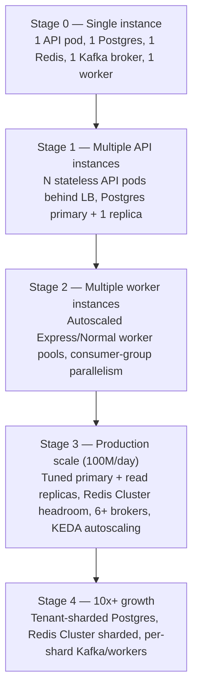

# Scalability

How this system grows from a single developer instance to 100M SMS/day, which components scale for free, which ones need a deliberate lever pulled, and what breaks first if traffic keeps growing past that. See [architecture.md](architecture.md) for component responsibilities, [decisions.md](decisions.md) for why each scaling-relevant choice was made, and [database.md](database.md)/[queue.md](queue.md) for the mechanisms referenced here.

## Scale envelope

- 100M SMS/day → **~1,157 msgs/sec average**.
- Traffic is explicitly **skewed, not uniform**: peak is not 2-3x average. A handful of heavy tenants push sustained bursts an order of magnitude above the mean (tens of thousands of msgs/sec), while a long tail of light tenants contributes negligible individual load. Every number below is sized against this skew, not against a flat average — a design that only survives uniform load doesn't survive this traffic shape.

This skew is precisely what forced two design decisions elsewhere in the system: fair scheduling exists because a single heavy tenant's burst must not starve everyone else ([decisions.md](decisions.md) ADR-006), and capacity planning below is done per-tenant-percentile, not per-system-average.

## Scaling path

| Stage | API Service | PostgreSQL | Redis | Kafka | Workers |
|---|---|---|---|---|---|
| **Dev / demo** | 1 pod | 1 instance | 1 instance | 1 broker (KRaft) | 1 Express + 1 Normal |
| **Small production** | N pods behind LB | Primary + 1 read replica | 1 instance, Sentinel for failover | 3 brokers, RF=3 | Autoscaled 2-10 per pool |
| **Target scale (100M/day)** | Autoscaled on CPU + RPS | Tuned primary (PgBouncer) + 2+ read replicas | Cluster if scheduler ops/sec approaches ceiling | 6+ brokers, partitions tuned per topic | KEDA-autoscaled on consumer lag (Normal) / queue depth (Express) |
| **10x+ growth** | Unchanged — scales linearly | **Sharded by `tenant_id`** (consistent hashing), each shard an independent primary + own outbox/relay | Cluster, sharded by tenant hash | Partitions/brokers scaled per shard | Scaled per shard |

Each stage is a config/infrastructure change except the last: tenant sharding is an application-level migration (see [Database bottlenecks](#database-bottlenecks) below), not a knob.

## Stateless APIs

The API Service holds no in-process state that survives a request — no session affinity, no local cache a client depends on, no sticky routing requirement. Every piece of cross-request state it touches (idempotency locks, wallet balance, rate-limit counters) lives in Postgres or Redis, not in the pod.

This is what makes horizontal scaling "add more pods" rather than "re-architect." A new API pod is immediately as capable as any existing one the moment it passes its readiness probe — no warm-up, no state transfer, no coordination with peers. It is also why a rolling deploy is safe by default: killing any subset of API pods loses zero durable state, only in-flight requests to those specific pods (handled by the load balancer's connection draining).

## Horizontal scaling

**API tier** is embarrassingly parallel and, in practice, never the bottleneck at this system's scale — CPU-bound on request validation and JSON (de)serialization, easily saturating a pod well below where Postgres or Kafka would become the constraint first. Scale on CPU utilization + RPS; no unusual autoscaling logic needed.

**Worker tiers** scale differently by design (see [decisions.md](decisions.md) ADR-005):

- **Express workers** autoscale on *queue depth*, not consumer lag, and with deliberately tighter headroom than Normal — the autoscaler must react before a latency SLA is at risk, not after. Overprovisioning idle Express capacity is an accepted cost of the SLA guarantee.
- **Normal workers** autoscale on *Kafka consumer lag* — there's no hard latency SLA to protect early, so the autoscaler can react to sustained lag growth rather than instantaneous depth.

Neither worker pool shares infrastructure with the other, so scaling one has zero effect on the other's capacity or latency profile — the entire point of physical isolation.

## Consumer groups

Kafka consumer groups are the mechanism behind both worker-pool scaling and the Fair Scheduler's high availability:

- `sms.express` (12 partitions) and `sms.normal` (64 partitions) each support up to as many active consumers as they have partitions before additional consumers sit idle. Partition counts are set with meaningful autoscaling headroom above expected steady-state worker-pool size.
- The Fair Scheduler itself runs as a consumer group of 3-5 instances against `sms.normal` — not for parallel *processing* per se (DRR state is centralized in Redis regardless of which scheduler instance reads a given partition), but for **availability**: if one scheduler instance dies, Kafka's group rebalance reassigns its partitions to a surviving instance within seconds, with no manual intervention and no message loss (offsets are only committed after successful hand-off to Redis).
- Consumer lag per topic/partition is the primary Kafka-side capacity signal (see [Monitoring](#monitoring)) — sustained, growing lag on `sms.normal` means Normal worker capacity or Fair Scheduler throughput hasn't kept pace with ingestion, not a Kafka problem per se.

## Database bottlenecks

**PostgreSQL is the true long-term scaling constraint**, because wallet correctness ([decisions.md](decisions.md) ADR-008) requires single-writer semantics per tenant row — this is a correctness requirement, not an accident of implementation, so it can't be engineered away without changing what "atomic wallet deduction" means.

A well-tuned single primary (NVMe storage, tuned `shared_buffers`/`work_mem`, PgBouncer connection pooling) comfortably sustains commodity numbers of 10K-50K simple `UPDATE`/sec — well above the ~1,157 avg / tens-of-thousands peak TPS this system targets. The ceiling is real but distant at current scale.

The documented scale-out lever when that ceiling is approached is **tenant-based sharding**: consistent-hash `tenant_id` → shard, each shard a fully independent primary with its own `outbox_events` table and own relay instances. This preserves the single-transaction wallet+SMS invariant *within* a shard (a tenant's writes always land on the same shard) without requiring any cross-shard coordination — the invariant was always scoped to "per tenant," never "globally serialized," so sharding by tenant doesn't weaken it.

**What sharding does *not* fix:** a single tenant's own wallet-row contention. Sharding distributes *different* tenants across primaries; it does nothing for one extremely heavy tenant's own concurrent-write rate against its own row, which is a different axis entirely (see [decisions.md](decisions.md) ADR-008's sub-balance-sharding note — deferred, not needed at stated scale).

## Read replicas

Reporting (`GET /reports/sms`, `GET /batches/{id}`, `GET /sms/{id}`) is deliberately decoupled from the OLTP write path: every `GET` reads from a replica, never the primary. This is a hard rule, not a default — a report query competing with wallet-deduction transactions for primary I/O would put report load directly on the critical path of money-touching writes, which is the one place this system refuses to trade correctness/latency for convenience.

At higher scale, a single replica may not be enough to serve report volume independent of replication lag concerns; the next levers, in order, are: additional replicas behind a read-only routing layer, then materialized summary tables updated asynchronously via an outbox-driven consumer (not synchronously per request), then a dedicated analytics store (e.g. ClickHouse) for report queries specifically. None of these are needed at the stated 100M/day target — a tuned replica suffices — but the escalation path exists before it's needed.

## Partitioning

`sms` is range-partitioned by `created_at` (monthly) from day one — see [database.md](database.md) for the DDL and rationale. At ~3B rows/month, monthly partitions keep individual partition size manageable for autovacuum and index maintenance; a scheduled job creates the next partition ahead of the boundary, and a retention job detaches (not deletes) partitions past the retention window before archiving to cold storage. `DROP` on a detached partition is instant; a `DELETE` at this row count would be a multi-hour, WAL-flooding operation — partitioning isn't an optimization here, it's the only viable retention mechanism at this table's size.

This is orthogonal to, and doesn't substitute for, tenant-based sharding above: partitioning bounds *table maintenance cost over time* on a single primary; sharding bounds *write throughput across primaries*. Both are needed at different growth stages.

## Queue scaling

Kafka scales on two independent axes:

- **Partition count** bounds consumer parallelism per topic — `sms.normal`'s 64 partitions vs. `sms.express`'s 12 reflects their different scaling needs (Normal carries the bulk of volume and needs headroom for both Fair Scheduler and worker-pool parallelism; Express is provisioned for latency headroom, not raw throughput).
- **Broker count** bounds cluster-wide throughput and replication headroom (`RF=3`, `min.insync.replicas=2` — see [queue.md](queue.md) for ordering/durability guarantees this buys).

Neither axis requires a schema or application change to scale — partition count can be increased (though not decreased) and broker count scaled independently of the services consuming them, as long as consumers correctly rebalance (standard consumer-group behavior, no custom logic needed).

## Redis scaling

Redis carries two independent workloads (see [decisions.md](decisions.md) ADR-002): idempotency locking (API tier) and DRR scheduler state (Fair Scheduler). Both are low-latency, moderate-volume operations — 100M/day peak translates to low tens-of-thousands of Redis ops/sec, comfortably inside a single well-provisioned primary's ~100K+ ops/sec ceiling.

If that ceiling is ever approached, Redis Cluster sharded by tenant hash is the lever — both workloads are naturally tenant-partitionable (a tenant's idempotency keys and DRR queue state have no cross-tenant dependency), so sharding doesn't require redesigning either mechanism, just repointing key routing at cluster slots.

Because Redis is explicitly non-authoritative for both workloads ([decisions.md](decisions.md) ADR-002), scaling it is a pure performance lever — there's no correctness migration involved, unlike Postgres sharding which touches the money-critical write path.

## Monitoring

Capacity decisions in this document are driven by the metrics defined in [observability.md](observability.md), specifically:

- `outbox_oldest_unpublished_age_seconds` — earliest signal of a Kafka or relay capacity problem, before consumer-side symptoms appear.
- Kafka consumer lag per topic/partition — the primary signal for whether worker-pool or Fair Scheduler capacity has fallen behind ingestion.
- `scheduler_tenant_wait_seconds{p50,p99}` — proves the fairness property holds under real load, not just in design; a diverging p99 at similar tenant volume signals a DRR implementation bug or genuine Redis-side capacity issue, not "expected" behavior.
- `operator_dispatch_duration_seconds{tier}` — split by tier specifically so Express SLA compliance is independently measurable from Normal throughput.
- Postgres primary: connection pool saturation, replication lag to read replicas, autovacuum backlog on the `sms` partitions.

Capacity planning is metrics-driven, not calendar-driven: autoscaling policies react to the above in real time, and infrastructure sizing (broker count, replica count, shard boundaries) is revisited when sustained trends in these metrics — not a fixed schedule — indicate headroom is shrinking.

## Capacity planning

| Component | Sizing driver | Target scale headroom |
|---|---|---|
| API pods | RPS + CPU per pod | Linear scale-out, no ceiling below LB/network limits |
| Postgres primary | Row-level `UPDATE`/sec on hottest wallet row; total write TPS | 10K-50K UPDATE/sec commodity ceiling vs. ~1,157 avg / tens-of-thousands peak target — 10-50x headroom before sharding is required |
| Postgres read replicas | Report query volume + acceptable replication lag | Add replicas linearly; escalate to materialized views/ClickHouse before replica count becomes unwieldy |
| Kafka partitions (`sms.normal`) | Fair Scheduler + Normal worker consumer-group parallelism | 64 partitions sized for scheduler HA (3-5 instances) and worker autoscale ceiling with room to grow before repartitioning |
| Kafka partitions (`sms.express`) | Express worker consumer-group parallelism, throughput not fairness | 12 partitions — sized for throughput headroom under Express's assumed <5-10% of total volume (see [assumptions.md](assumptions.md)) |
| Redis ops/sec | Idempotency locks + DRR queue push/pop | Low tens-of-thousands ops/sec target vs. ~100K+ single-primary ceiling |
| Worker pool size | Autoscaled on queue depth (Express) / consumer lag (Normal) | No static sizing — reactive by design; static minimums set for baseline SLA headroom during traffic troughs |

Sizing is intentionally asymmetric: Express is provisioned with generous headroom relative to its actual volume share because its cost of under-provisioning (SLA breach) is much higher than its cost of over-provisioning (idle capacity). Normal is sized closer to actual demand because its cost of under-provisioning (temporarily growing queue depth) is recoverable and has no contractual consequence.

## Failure scenarios

| Failure | System behavior | Why |
|---|---|---|
| **Database unavailable** | API returns `503` fast via a DB health circuit breaker; no new submissions accepted. Already-outbox-published messages continue draining through Kafka → workers → operator uninterrupted. | Correctness over availability on the money-touching write path — a deliberate CP choice. The outbox pattern already decouples the async pipeline's availability from momentary DB blips; only *new* submissions are blocked, which is unavoidable since the balance check itself requires the DB. |
| **Kafka unavailable** | Submissions keep succeeding — deduction and persistence are already durable in Postgres. The relay's publish step fails and retries; `outbox_events` backlog grows, monitored via oldest-unpublished-age. Drains automatically on recovery. | The entire payoff of the transactional outbox ([decisions.md](decisions.md) ADR-004): submission availability never hard-depends on Kafka's momentary availability. |
| **Worker crash** | Kafka redelivers the in-flight message to another consumer on rebalance (at-least-once). The new worker checks `sms.status` before dispatching — skips re-send if already `SENT_TO_OPERATOR`. | Accepted gap: a crash between "operator call succeeded" and "status write committed" can still duplicate a send to the end recipient — inherent to at-least-once delivery at the operator boundary, called out explicitly rather than falsely promised as exactly-once. |
| **Network partition (Postgres)** | Writes fail closed (`503`) until failover completes. Failover (Patroni) must **fence** the old primary — at most one writer accepting writes at any time — or a split-brain could let two primaries independently deduct the same tenant's balance. | Money correctness > availability, consistently applied. |
| **Network partition (Kafka)** | ISR/leader-election handles this natively; RF=3 with `min.insync.replicas=2` prevents acknowledged-then-lost messages. | Standard Kafka HA configuration, no custom handling needed. |
| **Network partition (Redis)** | Sentinel/Cluster quorum promotes a new primary; DRR state rebuilds from Kafka's still-durable `sms.normal` backlog since Redis is a scheduling ledger, not a source of truth. Normal dispatch pauses briefly; Express is entirely unaffected. | Demonstrates the payoff of keeping Redis out of the Express path and out of any source-of-truth role. |

## What does not scale by adding more of the same

- **A single tenant's wallet row** — sharding by `tenant_id` distributes different tenants across primaries, but does nothing for one tenant's own concurrent-write rate against its own row. The mitigation is sub-balance sharding *within* a tenant, a different axis than horizontal service scaling, deferred until a real access pattern demands it ([decisions.md](decisions.md) ADR-008).
- **The Fair Scheduler's centralized Redis ledger**, if it ever becomes a true bottleneck (not expected at stated scale) — requires either Redis Cluster sharding by tenant hash, or accepting the decentralized per-partition DRR alternative's weaker cross-partition fairness guarantee as the trade for removing the centralized dependency ([decisions.md](decisions.md) ADR-006).

## Future scaling options

| Option | When it becomes necessary | Sketch |
|---|---|---|
| **Tenant-sharded Postgres** | Sustained write TPS approaching the single-primary ceiling (10K-50K UPDATE/sec) | Consistent-hash `tenant_id` → shard; each shard independent primary + own outbox/relay; preserves per-tenant transactional invariant with zero cross-shard coordination |
| **Sub-balance wallet sharding** | One tenant's own concurrent single-SMS call rate exceeds ~1K-5K/sec sustained | Split that tenant's balance across N sub-rows with periodic reconciliation; orthogonal to tenant sharding above |
| **CDC-based outbox relay** | Poll latency or DB load from polling becomes measurable (not currently a bottleneck) | Replace polling with Debezium WAL tailing — near-instant publish, removes periodic-poll load from the primary |
| **Materialized reporting store / ClickHouse** | Read replicas can no longer serve report volume within acceptable replication lag | Async, outbox-driven aggregation into a store built for analytical scan patterns, fully isolated from OLTP |
| **Multi-region deployment** | A multi-region requirement emerges (not a stated v1 requirement) | Tenant pinned to a home region; active-active per region with async cross-region replication for DR; requires revisiting the single-primary-per-shard model into a per-region-primary model with an explicit tenant-to-region assignment story |
| **Redis Cluster sharding** | Scheduler or idempotency ops/sec approaches single-primary ceiling | Shard by tenant hash — both workloads are naturally tenant-partitionable, no redesign needed, just key-routing changes |
