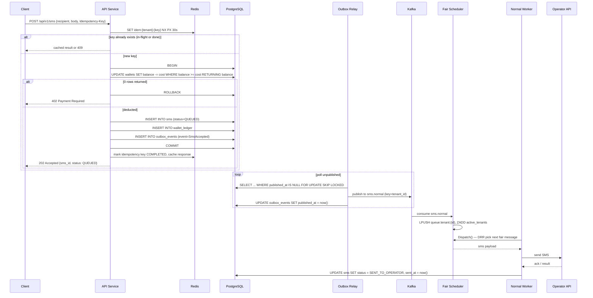
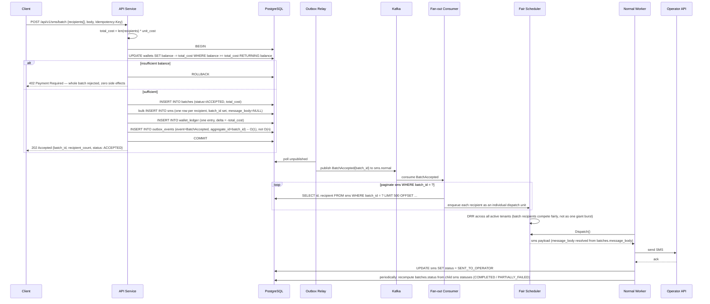
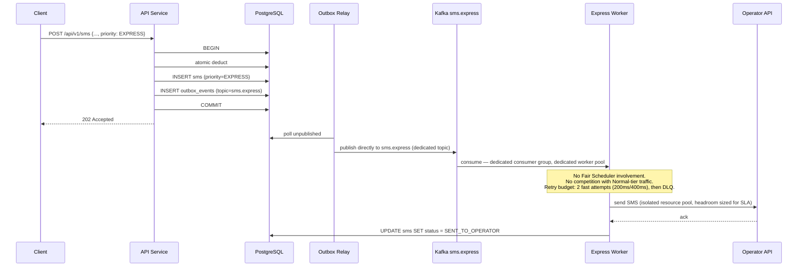

# Sequence Diagrams

## Single SMS

## Batch SMS

**Atomicity note:** "atomic" here means the *acceptance decision* — either the entire batch is charged and persisted, or none of it is. It does **not** mean every recipient is guaranteed delivery in lockstep; delivery is inherently per-recipient and best-effort against the operator (a batch can end up `PARTIALLY_FAILED` at the *delivery* level while having been `ACCEPTED` atomically at the *charge* level — these are different guarantees and the docs are explicit about not conflating them).

## Express SMS

**Why Express bypasses the scheduler entirely, not just gets scheduled first:** Express's latency guarantee must hold *regardless of Normal-tier load*. If Express shared any component with Normal — the same topic, the same consumer group, or even the same DRR ledger with a "priority weight" — then a large enough Normal surge could still add queueing delay to Express through resource contention on that shared component (CPU, Redis round-trips, consumer lag). Full physical separation (topic → consumer group → worker pool → even a separate node pool/resource quota in production) means Express latency is a function of Express volume and Express capacity alone — a property that's independently provable and testable, not an emergent behavior of a shared scheduler under load.
