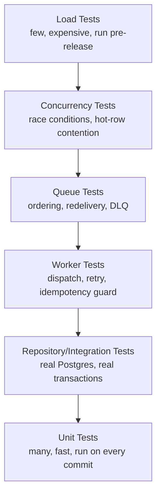

# Testing Strategy

What gets tested at each layer, why that layer is tested the way it is, and specifically how the system's non-negotiable invariants ([architecture.md](architecture.md)) get verified rather than assumed. The guiding principle: correctness-critical paths (wallet, idempotency, fairness) get tests that would actually fail if the invariant broke, not tests that merely exercise the code.

## Test pyramid for this system

The shape is inverted from a typical CRUD service: this system spends more of its testing budget on concurrency and integration correctness than a normal pyramid would, because the hardest bugs here (double-spend, starvation, lost messages) are concurrency and integration bugs by nature — they don't show up in a unit test that mocks the database.

## Unit tests

Pure logic with no I/O: request validation (E.164 parsing, message length against encoding limits), DRR quantum/deficit arithmetic in isolation, cost calculation, cursor encoding/decoding, error-code mapping. Fast, run on every commit, no test containers required.

**What's deliberately *not* unit-tested here:** anything involving the wallet UPDATE statement, the outbox relay's polling loop, or Kafka consumer behavior — mocking Postgres/Kafka for these would test the mock's behavior, not the system's, and this is exactly the kind of test that passes while the real thing is broken (see [decisions.md](decisions.md) — the discipline of not trusting a mocked dependency for a correctness-critical path applies to tests, not just architecture).

## Integration tests

Run against real Postgres, Redis, and Kafka via test containers (Testcontainers or equivalent) — not mocks, not in-memory fakes. This is a deliberate cost/fidelity trade: slower than unit tests, but the wallet deduction's correctness *is* Postgres's row-locking behavior ([database.md](database.md) Concurrency), so a test suite that fakes that behavior can't actually verify it.

Covered here: the full submission transaction (deduct + insert + outbox row, all-or-nothing), the refund transaction, idempotency key uniqueness constraint behavior under conflict, partition creation/retention job logic against a real partitioned table.

## Repository tests

One layer down from integration tests: each repository/data-access method tested against real Postgres for exactly what it claims to do — the wallet UPDATE returns zero rows on insufficient balance, the outbox poll query only returns unpublished rows and respects `SKIP LOCKED` under concurrent callers, the cursor-pagination query returns stable results under concurrent inserts into the same range. These are narrower and faster than full integration tests because they exercise one query/method at a time rather than a full request lifecycle, but still require a real database — the properties under test are properties *of* Postgres, not of application code wrapping it.

## Worker tests

Exercise the worker dispatch loop (§ [queue.md](queue.md) Worker Pool) against a fake `OperatorClient` (a real interface substitution, not a database mock — the operator boundary is exactly where the design already accepts a black-box abstraction, see [assumptions.md](assumptions.md) #2) with real Postgres and Kafka underneath:

- Status transition correctness: `QUEUED → SENT_TO_OPERATOR` only on operator success.
- Retry classification: operator timeout/5xx retried per tier's backoff table; operator 4xx marked `FAILED` immediately without consuming retry budget ([queue.md](queue.md) Retry Queue).
- Internal-redelivery idempotency guard: a worker that receives an already-`SENT_TO_OPERATOR` message skips re-dispatch — tested by directly re-delivering a message to a second worker instance mid-test and asserting exactly one operator call was made.
- DLQ landing: retry exhaustion produces a DLQ message with correct failure metadata and triggers the refund transaction — tested end-to-end through a real (test) Kafka topic, not by calling the DLQ handler function in isolation, since the thing under test includes "does the message actually land on the DLQ topic."

## Queue tests

Verify the messaging-layer guarantees claimed in [queue.md](queue.md) actually hold against a real (test) Kafka cluster:

- Express and Normal topics never cross-deliver — a message published to `sms.express` is never observed by a Normal-tier consumer group, and vice versa.
- Consumer group rebalance correctly redistributes partitions on a simulated consumer crash, with no message loss (offset behavior verified directly, not inferred).
- Outbox relay's `SKIP LOCKED` poll under multiple concurrent relay instances publishes each row exactly once to Kafka — this is the specific property that makes horizontal relay scaling safe, and it's tested by running N relay instances against the same outbox table and asserting no duplicate publishes.
- DLQ topic receives exactly the messages that exhausted retries, with retention/replay semantics intact.

## Concurrency tests

The highest-value tests in this system, because the bugs they catch (double-spend, lost updates, starvation) are invisible in a single-threaded test run and expensive in production. Structure: spin up N concurrent `asyncio` tasks (`asyncio.gather`) / async clients against a shared fixture and assert an invariant holds across all of them, not just that each individually "worked."

- **Wallet double-spend:** N concurrent single-SMS requests against a tenant with balance for exactly `N-1` of them; assert exactly `N-1` succeed and exactly 1 receives `402`, and that final balance is precisely `0` — not "close to zero," not "eventually consistent," exactly zero. This is the direct test of [decisions.md](decisions.md) ADR-008's core claim.
- **Idempotency race:** N concurrent requests with the *same* `Idempotency-Key`; assert exactly one is charged and the other `N-1` receive the identical cached response or `409`, never a distinct second charge.
- **Batch atomicity:** a batch sized to exceed available balance by exactly one recipient's cost; assert zero `sms` rows are inserted and balance is unchanged — proving all-or-nothing, not "mostly accepted."
- **Fair Scheduler starvation:** one heavy tenant sustaining a large backlog and several light tenants sending intermittently; assert every light tenant's message wait time stays bounded (does not grow unboundedly with the heavy tenant's backlog depth) — the direct test of the DRR fairness claim in [decisions.md](decisions.md) ADR-006, not just "the scheduler ran without erroring."
- **Fair Scheduler full-capacity-when-idle:** a single active tenant; assert it receives dispatch throughput equivalent to full Normal-tier worker capacity, with no artificial per-tenant ceiling — the direct test of the other half of ADR-006's claim.

## Load tests

Run pre-release against a staging environment sized like production, not against unit-test fixtures. Goals:

- Confirm the capacity-planning numbers in [scalability.md](scalability.md) — sustained throughput at the target average (~1,157 msg/sec) plus simulated skewed bursts (a handful of synthetic heavy tenants at an order of magnitude above baseline) without Express latency SLA breach.
- Confirm autoscaling policy behavior under real ramp conditions — does Express worker HPA react fast enough to avoid a transient SLA breach during a burst; does Normal-tier consumer lag recover after a sustained spike ends.
- Soak tests (sustained load over hours, not a short spike) to surface slow leaks — connection pool exhaustion, unbounded Redis key growth, partition-maintenance job interaction with live write traffic.

## Failure injection

Deliberately break each dependency the [scalability.md](scalability.md) Failure Scenarios table makes a claim about, and verify the claimed behavior actually happens rather than trusting the design doc:

| Injected failure | Claim under test |
|---|---|
| Kill Postgres primary mid-traffic | API fails closed (`503`) on new submissions; already-published Kafka messages keep draining through workers uninterrupted |
| Block Kafka broker traffic | Submissions keep succeeding; `outbox_events` backlog grows and drains automatically once connectivity restores |
| Kill a worker pod mid-dispatch | Kafka redelivers to a surviving consumer; the surviving worker's status check prevents re-dispatch of an already-terminal message |
| Kill Redis primary | DRR state rebuilds correctly from the still-durable `sms.normal` backlog after failover; Express dispatch is entirely unaffected throughout |
| Simulated operator 5xx storm | Retry/backoff behaves per the tier's table; retry exhaustion correctly lands on DLQ with accurate failure metadata and triggers refund |
| Simulated network partition isolating the Postgres primary | Patroni fencing prevents the old primary from accepting writes post-failover — tested by attempting a write against the fenced node and asserting rejection, not by trusting that fencing "should" work |

Failure injection tests are the ones most likely to catch a documentation/reality drift — if [scalability.md](scalability.md) claims a behavior and the injection test can't reproduce it, the design doc is wrong (or the implementation is), and either way it needs fixing before release, not just a note.
